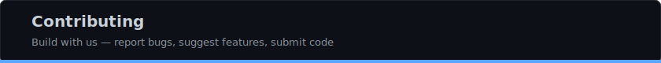

# Contributing to NUTbits

Welcome! NUTbits is open source and contributions are appreciated — code, docs, design, testing, ideas, and spreading the word.

**[Ways to Help](#ways-to-help) · [Submit Code](#submit-code) · [Code Style](#code-style) · [Before You Submit](#before-you-submit) · [Open Backlog](#open-backlog) · [Questions](#questions)**

---

## Standing on the Shoulders of Giants

NUTbits wouldn't exist without:

- **[Calle](https://github.com/callebtc)** and the **[Cashu](https://cashu.space)** team — the ecash protocol and [cashu-ts](https://github.com/cashubtc/cashu-ts)
- **[supertestnet](https://github.com/supertestnet)** — [bankify](https://github.com/supertestnet/bankify), the original inspiration
- **[LNbits](https://github.com/lnbits/lnbits)** team — the Lightning accounts system NUTbits was built to power
- **[nostr-core](https://www.npmjs.com/package/nostr-core)** by [Pratik227](https://github.com/Pratik227) — the Nostr + LNURL library

If you contribute here, you're building on all of their work.

## Ways to Help

### Report Bugs

[Open an issue](https://github.com/DoktorShift/nutbits/issues/new). Include:
- What happened vs. what you expected
- NUTbits version (`package.json`) and Node.js version
- Relevant logs (**mask secrets, seeds, and NWC strings!**)

### Suggest Features

Open an issue with your idea. We especially welcome:
- UX improvements - make things easier, clearer, faster
- New NUT support (NUT-15 multi-path, NUT-25 BOLT12)
- Better error messages - if you were confused, others will be too
- Testing and reliability ideas

### Improve Documentation

Good docs make or break a project. You can:
- Fix typos, unclear wording, broken links
- Add examples or diagrams
- Translate docs to other languages
- Write blog posts or tutorials about NUTbits

### Spread the Word

Not a coder? You can still help:
- Write about NUTbits on Nostr, Twitter, blogs
- Create demo videos or tutorials
- Share your NUTbits setup and how you use it
- Help others in issues and discussions
- Design graphics, icons, or illustrations

### Add Your App to the Deeplink Registry

If your app supports NWC, add it to NUTbits so users can connect in one tap. See **[DEEPLINK-APPS.md](docs/DEEPLINK-APPS.md)** - it's a two-file PR.


## Submit Code

1. Fork the repo
2. Create a branch (`git checkout -b my-feature`)
3. Make your changes
4. **Test across all interfaces** (see below)
5. Open a pull request

### Code Style

- Plain JavaScript — ES modules (`import`/`export`), no TypeScript, no build step
- `var` for declarations (project convention — not a bug)
- Semicolons at line ends
- Comments use `// ── Section Name ──` dividers for major blocks
- Minimal dependencies — stdlib over npm packages
- Follow existing patterns in the file you're editing

### Before You Submit

NUTbits has three interfaces that share the same API. **A change in one place can break another.** Before opening your PR, verify your changes work across all three:

```
┌─────────────┐     ┌─────────────┐     ┌─────────────┐
│     CLI     │     │     TUI     │     │     GUI     │
│  nutbits    │     │  nutbits    │     │  browser    │
│  <command>  │     │  (dashboard)│     │  :8080      │
└──────┬──────┘     └──────┬──────┘     └──────┬──────┘
       │                   │                   │
       └───────────────────┴───────────────────┘
                           │
                    ┌──────┴──────┐
                    │   API       │
                    │   :3338     │
                    └─────────────┘
```

**Checklist:**

- [ ] `npm start` — service boots without errors
- [ ] **CLI:** `nutbits status` / `nutbits connections` — commands work
- [ ] **TUI:** `nutbits` — dashboard loads, panels render, menu navigates
- [ ] **GUI:** open `http://127.0.0.1:8080` — pages load, data displays
- [ ] If you changed connections: create, fund, withdraw, revoke all work
- [ ] If you changed payments: pay and receive work end-to-end
- [ ] If you changed deeplinks: `GET /connect?appname=Test` serves the page

**What to watch for:**
- API response shape changes break the GUI and TUI (they parse the JSON)
- New fields need to be added to CLI tables, TUI panels, AND GUI views
- Dedicated vs shared balance logic must be consistent across all paths


## Open Backlog

Things we'd love help with, from quick wins to big projects:

### Quick Wins
- **Better error messages** — anywhere you got confused, make it clearer
- **App icons** — drop PNGs in `gui/public/app-icons/` for apps in the catalog
- **Docs polish** — fix typos, add examples, improve explanations

### Features
- **NUT-15** — multi-path payments (split across mints)
- **NUT-25 / BOLT12** — support for BOLT12 offers
- **Tests** — unit tests for store backends, integration tests for payment flows
- **Relay pooling** — shared WebSocket pool instead of per-connection (see `docs/BACKLOG-relay-pooling.md`)

### Design & UX
- **Mobile-responsive GUI** — make it work well on phones
- **Onboarding flow** — first-run wizard for new users
- **Connection health indicators** — show if a connection's relay is alive

### Infrastructure
- **Health check endpoint** — for monitoring and load balancers
- **Metrics** — connection count, payment volume, latency
- **Webhook notifications** — push events to external services

---

## Project Structure (Quick Reference)

```
nutbits.js                 # core bridge logic
api/
  server.js                # API server + deeplink /connect
  handlers/index.js        # all REST endpoints
  deeplink-apps.js         # deeplink app registry
  deeplink-page.js         # deeplink HTML page
cli/
  commands/                # one file per CLI command
  tui/                     # terminal UI (panels, menu, layout)
gui/
  src/views/               # Vue pages
  src/stores/              # Pinia stores
  src/data/appCatalog.js   # wizard app catalog
store/                     # storage backends (file, sqlite, mysql)
docs/                      # documentation
```

For the full breakdown, see **[AGENTS.md](docs/AGENTS.md)**.

---

## Questions?

Open an issue or reach out to [DoktorShift](https://github.com/DoktorShift) on GitHub or via [Nostr](https://njump.me/npub17c2szua46mc8ndp4grvy4z5465x0qxjge8tqx7vyu0vkqr24y2hssuuy6f).

Thanks for considering contributing!
