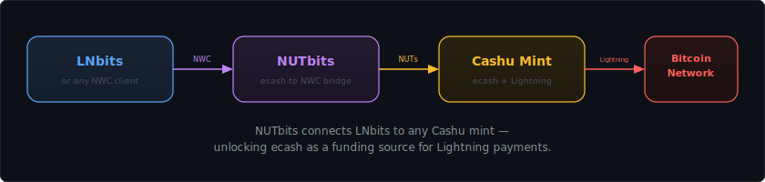
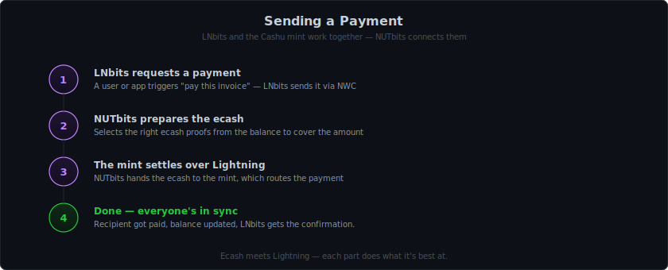
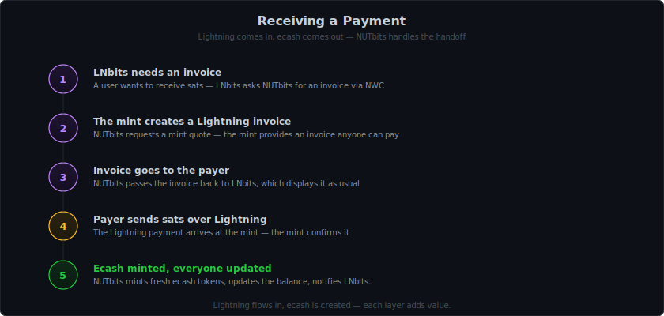

<p align="center">
  
</p>

## What is NUTbits?

NUTbits is a **translator** that sits between a [Cashu](https://cashu.space) ecash mint and [LNbits](https://lnbits.com) (or any app that speaks [Nostr Wallet Connect](https://github.com/nostr-protocol/nips/blob/master/47.md)).

It is **not** a wallet you open and click buttons in. You never interact with NUTbits directly. Instead, you use it as a **funding source** for LNbits — plug in the NWC connection string and your LNbits instance can send and receive Lightning payments through the mint.

Think of it as a **funding source adapter** — it makes any Cashu mint look like a Lightning wallet to LNbits.

## The Problem It Solves

Cashu mints and NWC apps speak different languages:

- **Cashu mints** use the NUT protocol — they deal in ecash tokens (proofs), mint quotes, and melt quotes.
- **NWC apps** use NIP-47 over Nostr — they send commands like "pay this invoice" or "create an invoice."

These two worlds can't talk to each other natively. NUTbits bridges the gap.

## The Flow

<p align="center">
  
</p>

## What Happens When You Send a Payment

<p align="center">
  
</p>

Each part does what it's best at — LNbits manages wallets and users, the mint handles Lightning, NUTbits connects them.

## What Happens When You Receive a Payment

<p align="center">
  
</p>

## What Does This Unlock?

NUTbits adds **Cashu ecash** as a new funding option for LNbits. Instead of connecting LNbits directly to a Lightning node, you can connect it to a Cashu mint — and the mint takes care of Lightning routing.

This is useful when:

- You want to get started quickly without setting up channels and managing liquidity
- You already trust a mint and want to put that ecash to work
- You're running a small setup and want something lightweight
- You want to experiment with ecash-powered Lightning payments

It's not a replacement for running your own node — it's a new option. Use whatever fits your setup best.

## The Trade-off: Trust

Cashu ecash is **custodial**. The mint holds the real funds. Your ecash tokens are IOUs — they're only worth something as long as the mint honors them.

This means:
- The mint could disappear with your funds
- The mint could get hacked
- The mint could be shut down

**Only use mints you trust, and only with amounts you can afford to lose.**

For maximum sovereignty, run your own mint (e.g. [Nutshell](https://github.com/cashubtc/nutshell) or [CDK](https://github.com/cashubtc/cdk)).

If an operator charges service fees, these are optional and transparent — advertised in the NWC connection info and reported on each payment. You always know the fee before it's charged.

## Key Concepts

### Ecash Proofs

When you "have a balance" in NUTbits, you actually hold **ecash proofs** — cryptographic tokens issued by the mint. Each proof has a specific sat value. NUTbits manages these automatically: selecting them for payments, storing new ones when you receive, and keeping them encrypted on disk.

### NWC (Nostr Wallet Connect)

NWC is a protocol that lets apps control a wallet over Nostr relays. NUTbits acts as the **wallet side** of this connection. When you set up NUTbits, it gives you a connection string that you paste into LNbits as a funding source. From that point on, LNbits sends commands (pay, receive, check balance) and NUTbits handles them.

### Mint Quotes

When NUTbits needs to create a Lightning invoice (to receive) or pay one (to send), it talks to the Cashu mint using "quotes":

- **Mint quote (NUT-4):** "I want to receive X sats" → the mint creates a Lightning invoice. When it gets paid, NUTbits mints new ecash.
- **Melt quote (NUT-5):** "I want to pay this invoice" → NUTbits gives ecash to the mint, and the mint pays the Lightning invoice.

### Service Fees (optional)

NUTbits can optionally charge a small fee on outgoing payments. This is disabled by default — NUTbits takes zero cut unless you turn it on.

When enabled, the fee is deducted from the sender's balance on each outgoing payment. The fee stays as ecash in the operator's balance. **Receiving payments is always free** — no fee is ever taken on incoming.

The fee is transparent: NWC clients that support it can read the fee policy from the `get_info` response and see the exact fee on each payment. Clients that don't support it simply ignore the extra field — nothing breaks.

This makes it possible to run NUTbits as a service for others, covering costs or earning a small margin. See **[CLI.md](CLI.md#service-fees)** for setup.

## Who Is This For?

- **LNbits operators** looking for a new funding source option
- **Cashu enthusiasts** who want to put their ecash to work with LNbits
- **Developers** building NWC-compatible apps who want to test against a real wallet
- **Anyone** curious about combining ecash, Lightning, and Nostr Wallet Connect

## Managing NUTbits

Once NUTbits is running, you can manage it from a second terminal:

```bash
nutbits              # interactive dashboard
nutbits balance      # check your balance
nutbits connections  # see your NWC connections
nutbits connect      # create a new connection
```

The management console lets you create multiple NWC connections with different permissions — one for LNbits with full access, another for a POS terminal with just pay and a daily spending cap. See **[CLI.md](CLI.md)** for the full guide.

## Related Reading

- [INSTALL.md](INSTALL.md) — Get NUTbits running in 5 minutes
- [CLI.md](CLI.md) — Management console reference
- [README.md](README.md) — Full technical reference
- [LNbits](https://lnbits.com) — Lightning accounts system that NUTbits was built to power
- [Cashu protocol](https://cashu.space) — Learn about ecash for Bitcoin
- [NIP-47 spec](https://github.com/nostr-protocol/nips/blob/master/47.md) — The NWC protocol NUTbits implements
