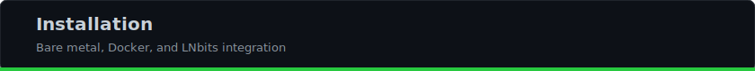
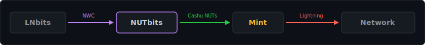

# Installation

## Requirements

- **Node.js** >= 18
- A **Cashu mint** ([find one](https://bitcoinmints.com) or run your own)
- A **Nostr relay** (public or self-hosted)

## Bare Metal

```bash
git clone https://github.com/DoktorShift/nutbits.git
cd nutbits
npm install
```

### Configure

```bash
cp .env.example .env
```

Edit `.env` with your settings:

```bash
# Required
NUTBITS_MINT_URL=https://your-mint.example.com
NUTBITS_STATE_PASSPHRASE=your-strong-passphrase-here

# Optional: use SQLite for concurrent access (recommended for LNbits)
# NUTBITS_STATE_BACKEND=sqlite

# Optional: charge a service fee on outgoing payments (disabled by default)
# NUTBITS_SERVICE_FEE_PPM=10000    # 1% (parts per million)
# NUTBITS_SERVICE_FEE_BASE=1       # +1 sat per payment
```

> Need SQLite or MySQL? Install the driver: `npm install better-sqlite3` or `npm install mysql2`

### Start

```bash
npm start
```

On first run, NUTbits prints your NWC connection string:

```
=== YOUR NWC CONNECTION STRING (copy this, it won't be shown again) ===
nostr+walletconnect://abc123...?relay=wss://nostrue.com&secret=xyz789...
======================================================================
```

Copy this string. You'll need it to connect LNbits or any NWC client.

### Management Console (optional)

Make the `nutbits` command available:

```bash
npm link
```

Then open a second terminal (while the service is running):

```bash
nutbits              # interactive TUI dashboard
nutbits balance      # check balance
nutbits connections  # list NWC connections
```

No extra configuration — the CLI finds the running service and authenticates automatically.

> Don't want to `npm link`? Use `npm run cli` or `node bin/nutbits.js` instead.

See **[CLI.md](CLI.md)** for the full setup and command reference.

## Docker

```bash
git clone https://github.com/DoktorShift/nutbits.git
cd nutbits
cp .env.example .env
# Edit .env
docker compose up -d
```

View logs:

```bash
docker compose logs -f
```

The NWC connection string appears in the logs on first run.

### CLI access from the host

The CLI needs access to the management socket. Two options:

**Option A: HTTP API (simpler)**

Uncomment the port mapping in `docker-compose.yml` and set `NUTBITS_API_PORT=7777` in your `.env`:

```bash
# From the host
nutbits --http http://localhost:7777 status
```

**Option B: Socket volume mount (already configured)**

The `nutbits-sock` volume is shared. Find the socket path and connect:

```bash
nutbits --socket /var/lib/docker/volumes/nutbits_nutbits-sock/_data/nutbits.sock status
```

## Connect to LNbits

1. Start NUTbits and copy your NWC connection string
2. In LNbits, go to **Manage Server** > **Funding Sources**
3. Select **NWCWallet** as the funding source
4. Paste the NWC connection string
5. Save and restart LNbits



## Funding Your Wallet

NUTbits starts with a zero balance. To fund it:

1. From LNbits (or any NWC client), create an invoice using `make_invoice`
2. Pay the Lightning invoice from any Lightning wallet
3. NUTbits automatically mints ecash tokens when the invoice is paid
4. Your balance is now available for outgoing payments

## Verify It Works

Check the logs for:

```
[INFO] cashu wallet initialized {"mint":"https://...","name":"..."}
[INFO] NWC connection ready
```

From LNbits, check the balance — it should respond via NWC.

## Upgrading

```bash
cd nutbits
git pull
npm install
npm start
```

Your state file is preserved across upgrades. If upgrading to a new storage backend, see [DATABASE.md](DATABASE.md) for migration instructions.
