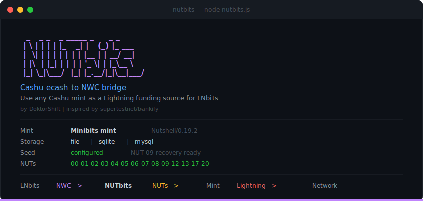
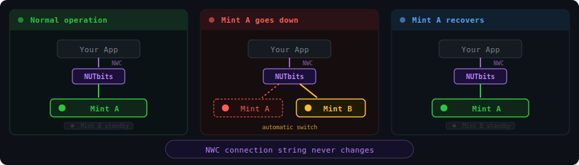

<p align="center">
  
</p>

## What is NUTbits?

NUTbits is an NWC wallet service that translates between **Cashu Mint** (NUTs) and **Nostr Wallet Connect** (NIP-47). It connects to a Cashu mint, manages ecash tokens automatically, and exposes a full NWC server, so any NWC-compatible app can send and receive Lightning payments through the mint.

Use case: plug the NWC string into **LNbits** as a funding source, and your ecash mint powers the entire [LNbits](https://github.com/lnbits/lnbits) instance with [60+ Extensions](https://extensions.lnbits.com).

Inspired by [supertestnet/bankify](https://github.com/supertestnet/bankify). Built on [@cashu/cashu-ts](https://www.npmjs.com/package/@cashu/cashu-ts) and [nostr-core](https://www.npmjs.com/package/nostr-core).

## Quick Start

See **[INSTALL.md](docs/INSTALL.md)** for full setup instructions (bare metal, Docker, LNbits integration).

```bash
git clone https://github.com/DoktorShift/nutbits.git && cd nutbits
npm install && cp .env.example .env
# Edit .env - set NUTBITS_MINT_URL and NUTBITS_STATE_PASSPHRASE
npm start
```

Paste the NWC connection string into LNbits (or any NWC client) as your funding source.

## Configuration

All settings in `.env` (see `.env.example`):

| Variable | Default | Description |
|---|---|---|
| `NUTBITS_MINT_URL` | `https://mint.coinos.io` | Cashu mint URL ([find mints](https://bitcoinmints.com)) |
| `NUTBITS_MINT_URLS` | _(optional)_ | Comma-separated mint URLs for failover (first = primary) |
| `NUTBITS_RELAYS` | `wss://nostrue.com` | Comma-separated Nostr relays |
| `NUTBITS_STATE_PASSPHRASE` | _(required)_ | Passphrase to encrypt state at rest |
| `NUTBITS_STATE_FILE` | `./nutbits_state.enc` | Path to encrypted state file |
| `NUTBITS_LOG_LEVEL` | `info` | `error`, `warn`, `info`, or `debug` |
| `NUTBITS_FEE_RESERVE_PCT` | `1` | Percentage reserved for routing fees |
| `NUTBITS_MAX_PAYMENT_SATS` | `0` | Max sats per payment (0 = no limit) |
| `NUTBITS_DAILY_LIMIT_SATS` | `0` | Max sats per day (0 = no limit) |
| `NUTBITS_HEALTH_CHECK_INTERVAL_MS` | `60000` | Mint health check interval in ms |
| `NUTBITS_FAILOVER_COOLDOWN_MS` | `10000` | Cooldown before retrying a failed mint |
| `NUTBITS_STATE_BACKEND` | `file` | Storage backend: `file`, `sqlite`, or `mysql` |
| `NUTBITS_SQLITE_PATH` | `./nutbits_state.db` | SQLite database path |
| `NUTBITS_MYSQL_URL` | _(optional)_ | MySQL connection URL |
| `NUTBITS_SERVICE_FEE_PPM` | `0` | Service fee in parts per million on outgoing payments (0 = disabled) |
| `NUTBITS_SERVICE_FEE_BASE` | `0` | Flat base fee in sats per outgoing payment (0 = disabled) |
| `NUTBITS_API_ENABLED` | `true` | Set to `false` to disable management API/CLI |

> **Storage:** See **[DATABASE.md](docs/DATABASE.md)** for backend comparison, setup, and migration.
> **Backups:** See **[BACKUP.md](docs/BACKUP.md)** for backup and recovery procedures.
> **Service fees:** See **[CLI.md](docs/CLI.md#service-fees)** for fee configuration, per-connection overrides, and revenue tracking.

Encryption: NIP-44 (preferred) with NIP-04 fallback, auto-detected per client.

## Supported Cashu NUTs

    -green) -green)       

| NUT | Name | Status | Used For |
|-----|------|--------|----------|
| [NUT-00](https://github.com/cashubtc/nuts/blob/main/00.md) | Cryptography & Models |  | Proof structure, keyset IDs |
| [NUT-01](https://github.com/cashubtc/nuts/blob/main/01.md) | Mint Public Keys |  | Key fetching via `loadMint()` |
| [NUT-02](https://github.com/cashubtc/nuts/blob/main/02.md) | Keysets |  | Keyset management, fee calculation |
| [NUT-03](https://github.com/cashubtc/nuts/blob/main/03.md) | Swap |  | Proof selection via `wallet.send()` |
| [NUT-04](https://github.com/cashubtc/nuts/blob/main/04.md) | Mint (BOLT11) |  | Receiving: `make_invoice` |
| [NUT-05](https://github.com/cashubtc/nuts/blob/main/05.md) | Melt (BOLT11) |  | Sending: `pay_invoice` |
| [NUT-06](https://github.com/cashubtc/nuts/blob/main/06.md) | Mint Info |  | Feature detection, capability gating |
| [NUT-07](https://github.com/cashubtc/nuts/blob/main/07.md) | Proof State Check |  | Verify proofs on mint recovery |
| [NUT-08](https://github.com/cashubtc/nuts/blob/main/08.md) | Lightning Fee Return |  | Change proofs from overpaid fees |
| [NUT-09](https://github.com/cashubtc/nuts/blob/main/09.md) | Signature Restore |  | Recover proofs from seed after data loss |
| [NUT-12](https://github.com/cashubtc/nuts/blob/main/12.md) | DLEQ Proofs |  | Verify mint signatures, anti-counterfeit |
| [NUT-13](https://github.com/cashubtc/nuts/blob/main/13.md) | Deterministic Secrets |  | Seed-based proof generation for recovery |
| [NUT-17](https://github.com/cashubtc/nuts/blob/main/17.md) | WebSocket Subscriptions |  | Instant invoice settlement (replaces polling) |

## Supported Nostr NIPs

   

| NIP | Name | Used For |
|-----|------|----------|
| [NIP-04](https://github.com/nostr-protocol/nips/blob/master/04.md) | Encrypted DMs | Legacy encryption fallback |
| [NIP-40](https://github.com/nostr-protocol/nips/blob/master/40.md) | Expiration Tag | Ignoring expired NWC requests |
| [NIP-44](https://github.com/nostr-protocol/nips/blob/master/44.md) | Versioned Encryption | Preferred encryption (auto-detected) |
| [NIP-47](https://github.com/nostr-protocol/nips/blob/master/47.md) | Nostr Wallet Connect | Core protocol for all wallet operations |

## Supported NWC Methods (NIP-47)

- `get_info` - wallet metadata, capabilities, encryption support
- `get_balance` - current balance in millisats
- `make_invoice` - create a Lightning invoice (NUT-4 mint)
- `pay_invoice` - pay a Lightning invoice (NUT-5 melt)
- `lookup_invoice` - check invoice status
- `list_transactions` - transaction history with filtering

**Notifications (push):**
- `payment_received` - sent when an incoming invoice settles
- `payment_sent` - sent when an outgoing payment completes

**Optional NIP-47 extensions** (non-breaking, clients can ignore or honor):
- `get_info` response includes `service_fee` object when fees are enabled (ppm, base, applies_to)
- `pay_invoice` response includes `service_fee` field (msats) separate from `fees_paid` (routing)

## How It Works


1. NUTbits generates a keypair and creates an NWC connection string
2. It subscribes to NWC request events (kind 23194) on configured Nostr relays
3. When a command arrives, it translates to Cashu operations via `@cashu/cashu-ts`:
   - `pay_invoice` -> wallet melts ecash to pay the Lightning invoice (NUT-5). Optional service fee deducted if configured.
   - `make_invoice` -> wallet requests a mint quote; upon payment, mints new ecash (NUT-4). No fees on incoming.
4. Responses are sent back as NWC events (kind 23195)

State (keys, ecash proofs, transaction history) is encrypted with AES-256-GCM and persisted to disk.

## Management Console

NUTbits includes a CLI and interactive TUI to manage the daemon **while it's running**. Open a second terminal and use `nutbits` to control connections, check balances, pay invoices, and monitor activity, all without restarting the service.

```bash
nutbits                    # interactive TUI dashboard
nutbits balance            # check balance across mints
nutbits connections        # list NWC connections
nutbits connect            # create new connection (guided wizard)
nutbits revoke <label>     # revoke a connection
nutbits pay <invoice>      # pay a Lightning invoice
nutbits receive <amount>   # create an invoice
nutbits history            # transaction history
nutbits fees               # view/manage service fees
nutbits mints              # mint status and health
nutbits relays             # relay connection status
```

Create multiple NWC connections with scoped permissions and spending limits; one for LNbits with full access, another for a POS with pay-only and a daily cap. Revoke any connection without affecting the others.

See **[CLI.md](docs/CLI.md)** for the full command reference and **[CONSOLE.md](docs/CONSOLE.md)** for TUI usage.

> Set `NUTBITS_API_ENABLED=false` in `.env` to disable the management API entirely.

## Security

- Encrypted state persistence (AES-256-GCM + scrypt)
- Event deduplication across relays (prevents double-payments)
- Per-payment and daily spend limits (global + per-connection)
- Per-connection service fee scoping
- NWC string masked in logs
- State file permissions restricted to owner (0600)
- Atomic state writes (crash-safe)
- Graceful shutdown with state save

All wallet data (ecash proofs, NWC keys, transaction history) is stored in an encrypted state file. **Read [STATE.md](docs/STATE.md) for backup, recovery, and decryption instructions** - this is critical if you're running NUTbits with real funds.

## Multi-Mint Failover

NUTbits supports optional multi-mint failover for higher reliability. Configure multiple mints and NUTbits will automatically switch to the next one if the active mint goes down. Your NWC connection string stays the same.

```bash
# In .env - first mint is primary, rest are fallbacks
NUTBITS_MINT_URLS=https://your-primary-mint.com,https://your-backup-mint.com
```



- On startup, NUTbits tries mints in order until one responds
- If the active mint goes down, it automatically fails over to the next healthy mint
- A background health check runs every 60s. When the primary mint recovers, NUTbits switches back
- In-flight invoices are checked against the mint that created them, even during failover
- **Your NWC connection string stays the same throughout**

### Trade-offs

Ecash proofs are cryptographically bound to the mint that issued them. Proofs from Mint A cannot be spent through Mint B. This means:

- **On failover**, your spendable balance is whatever was pre-funded on the new active mint. Proofs on the old mint are not lost; they become spendable again when that mint recovers.
- **In-flight invoices** (created but not yet paid) are tied to their originating mint. They will still resolve when that mint comes back online.
- **When a mint recovers**, NUTbits automatically switches back and the full balance on that mint is available again.

### For self-hosted / personal use

These trade-offs are minimal if you run your own mints. Pre-fund both mints, and failover is seamless. Recovery is automatic.

### For multi-user servers

Be aware that switching mints can temporarily affect users trying to pay out, since the spendable balance depends on which mint is active. If you run NUTbits as a funding source for others, consider whether the failover behavior fits your use case before enabling it in production.

## Documentation

| Document | Description |
|----------|-------------|
| [HOW-IT-WORKS.md](docs/HOW-IT-WORKS.md) | Plain-language guide; what NUTbits does and why |
| [CONSOLE.md](docs/CONSOLE.md) | How to use the TUI dashboard and CLI day-to-day |
| [CLI.md](docs/CLI.md) | Full command reference - flags, scripting, connections |
| [INSTALL.md](docs/INSTALL.md) | Setup guide - bare metal, Docker, LNbits |
| [DATABASE.md](docs/DATABASE.md) | Storage backends - file, SQLite, MySQL |
| [BACKUP.md](docs/BACKUP.md) | Backup, recovery, and encryption details |
| [STATE.md](docs/STATE.md) | Deep dive into the encrypted state file |

## Trust Model

Ecash is custodial. The mint holds the funds. Standard risks apply: the mint can steal, get shut down, or get hacked. Only use mints you trust, and only with amounts you can afford to lose.

NUTbits operators can optionally enable a service fee on outgoing payments. This fee is transparent - advertised in the NWC `get_info` response and reported separately in every `pay_invoice` response. Receiving payments is always free. By default, no fees are charged.

## Related Projects

- [Cashu](https://cashu.space) - Ecash protocol for Bitcoin
- [LNbits](https://lnbits.com) - Lightning accounts system
- [Nostr Wallet Connect (NIP-47)](https://github.com/nostr-protocol/nips/blob/master/47.md) - Wallet protocol over Nostr
- [nostr-core](https://nostr-core.netlify.app) - Nostr + LNURL library used by NUTbits
- [@cashu/cashu-ts](https://www.npmjs.com/package/@cashu/cashu-ts) - Cashu TypeScript library
- [supertestnet/bankify](https://github.com/supertestnet/bankify) - Original inspiration for this project
- [bitcoinmints.com](https://bitcoinmints.com) - Directory of Cashu mints

## License

[AGPL-3.0](LICENSE) - Free to use, modify, and distribute. If you run a modified version as a network service, you must share your source code.
