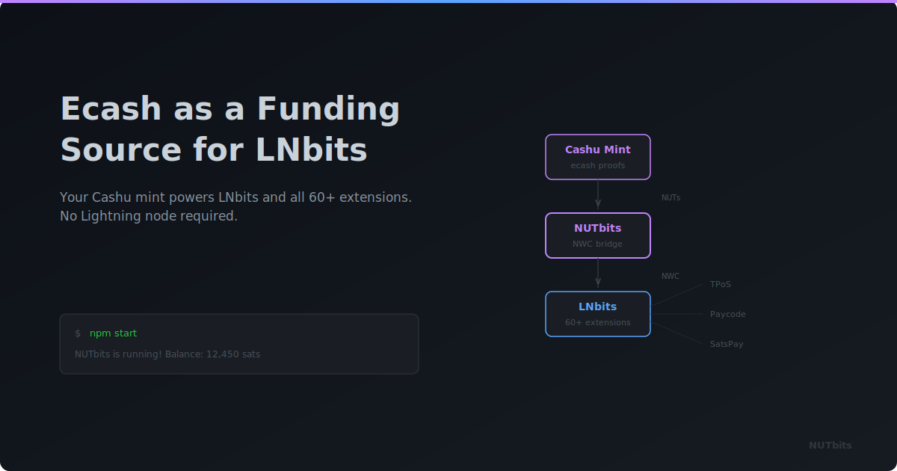

  

# Ecash as a Funding Source for LNBits

**What if the sats behind your LNBits instance lived as ecash on a Cashu mint?**

---

## A Different Kind of Funding Source

LNBits has always been flexible about what powers it. CLN, LND, Phoenixd, LndHub — bring your own backend, and LNBits wraps it in a beautiful multi-tenant Lightning accounts system with sixty-plus extensions.

NUTbits adds a new option to that list: a Cashu mint.

If you're already in the ecash world — running a mint, using one, experimenting with Cashu — this is where things get interesting. NUTbits bridges your mint to LNBits through Nostr Wallet Connect, and suddenly your ecash can power an entire Lightning platform.

## Why Ecash People Should Care About This

Cashu mints are great at what they do. Private transactions, bearer tokens, instant transfers between users. But the Cashu ecosystem is still young. The number of apps that natively speak Cashu is growing, but it's not huge yet.

LNBits, on the other hand, has been around for years. Sixty-plus extensions. Thousands of users. A mature ecosystem of tools for merchants, creators, communities, and developers.

NUTbits connects these two worlds. Your mint — the one you already run or trust — becomes the engine behind all of that. TPoS for shops. Lightning addresses for tips. NFC cards for tap-to-pay. Payment splitting. Invoicing. All funded by ecash.

Your ecash doesn't just sit in Cashu wallets anymore. It flows through the entire LNBits ecosystem.

## How It Fits Together

NUTbits connects to your Cashu mint and manages ecash on your behalf. It exposes that as an NWC connection — the same protocol LNBits already supports as a funding source. You paste the connection string into LNBits, and everything works.

When someone pays an invoice on your LNBits, the mint creates it and settles it through Lightning. When LNBits needs to send a payment, NUTbits converts ecash to a Lightning payment through the mint. Your users see normal Lightning invoices. They don't know ecash is involved — and they don't need to.

## The Trust Question

Worth being direct about this. When you use a mint as your funding source, you're trusting the mint operator. The ecash lives at that mint. If the mint goes offline, payments stop. If the mint has issues, your LNBits instance feels it.

If you run your own mint, you're trusting yourself — which is the same as running your own Lightning node, just a different stack. If you're using someone else's mint, you're trusting them the same way you'd trust any hosted funding source.

NUTbits supports multi-mint failover to help with reliability. But the trust relationship is real, and you should choose your mint the way you'd choose any piece of infrastructure you depend on.

## Who This Is For

This isn't for everyone, and that's fine. It's for people who are already thinking in ecash:

- **Mint operators** who want their mint to do more than serve Cashu wallets
- **Ecash enthusiasts** who want to see how Cashu integrates with the broader Lightning tool ecosystem
- **Communities** that already share a mint and want to build services on top of it
- **Tinkerers** who like the idea of an ecash-powered Lightning platform and want to try it

If you don't care about ecash, a traditional funding source might be simpler for you. But if you're already in this world — or curious about it — NUTbits opens a door between your mint and the LNBits ecosystem that didn't exist before.

## Once It's Connected

Everything just works. Every extension, every wallet, every feature LNBits offers — powered by ecash from your mint. Your users interact with Lightning the way they always do. The ecash layer is invisible to them but meaningful to you.

It's a new way to think about what a Cashu mint can be. Not just a wallet backend, but a platform backend.

---

**Curious?** Check out the [install guide](../docs/INSTALL.md) or browse the [source on GitHub](https://github.com/DoktorShift/nutbits).
