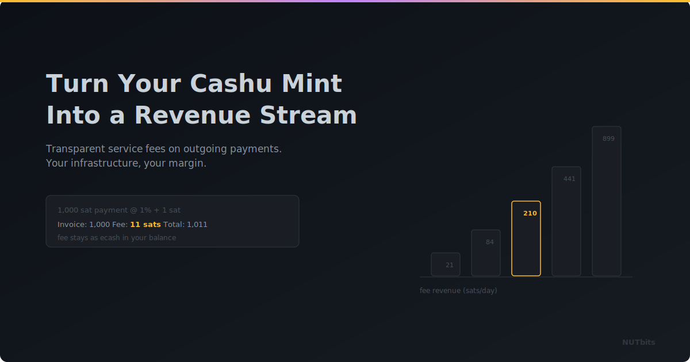

  

# Turn Your Cashu Mint Into a Revenue Stream

**You're already running the infrastructure. NUTbits lets you earn from the value you're providing.**

---

## The Mint Operator's Dilemma

You run a Cashu mint. You're covering the server costs, managing the Lightning liquidity, keeping things online. Your users get private, instant ecash, and you get... the satisfaction of contributing to the ecosystem.

That's great for a while. But servers cost money. Liquidity isn't free. And if your mint gets popular, the costs grow.

Most mint operators today absorb those costs. There's no clean, built-in way to charge for the service you're providing. The mint itself doesn't have a service fee concept at the NWC level.

NUTbits changes that.

## A Fee Layer You Control

When you run NUTbits in front of your mint, you can add a service fee to outgoing payments. It's simple: a percentage, a flat fee per payment, or both.

Set it to 1%, and every time someone sends 10,000 sats through an NWC connection, 100 sats stay with you as revenue. That's it. No complicated setup, no invoicing, no chasing payments. The fee is collected automatically, transparently, on every outgoing transaction.

Receiving is always free; you're only charging on the payments that actually cost your mint Lightning routing fees.

## What You're Actually Charging For

Think about what you provide as a mint operator:

- **Lightning access** - your users transact on the Lightning Network through your infrastructure
- **Liquidity** - you manage the channels so they don't have to
- **Privacy** - ecash gives your users better privacy than most Lightning wallets
- **Uptime** - you keep everything running

That's real value. A service fee just makes the exchange explicit. Your users get convenient, private Lightning payments. You get compensated for making that possible.

## Different Rates for Different Connections

Not every connection needs the same pricing. NUTbits lets you set fee rates per connection:

- Your own LNBits instance? No fee.
- A friend's wallet? A small fee to cover costs.
- A commercial client? A higher rate that reflects the value.

You can run tiered pricing from a single NUTbits instance connected to a single mint. Each NWC connection gets its own rate.

## Tracking What You Earn

NUTbits tracks your fee revenue automatically. You can check your earnings anytime: today's revenue, total revenue, broken down by connection. If you need the data for a dashboard or accounting, it's available in JSON too.

Every sat is accounted for. You always know exactly what your mint infrastructure is earning.

## The Math Works

Let's keep it realistic. A modest mint with moderate traffic, say a hundred outgoing payments a day averaging 5,000 sats each. At a 1% service fee, that's about 5,000 sats a day. Around 150,000 sats a month.

That won't make anyone rich. But it covers server costs, contributes to your liquidity reserves, and turns a hobby project into something sustainable.

For busier mints with commercial clients? The numbers get more interesting.

## Simple to Set Up

Two configuration values. That's all it takes. Set your percentage fee, optionally add a flat fee per payment, and restart NUTbits. From that moment on, every outgoing payment through any NWC connection generates revenue.

The fee is fully transparent. It's advertised when clients connect and reported separately on every payment. No hidden charges.

---

**Your mint is already doing the hard work.** NUTbits just lets you get paid for it.

[GitHub](https://github.com/DoktorShift/nutbits) · [How It Works](../docs/HOW-IT-WORKS.md)
