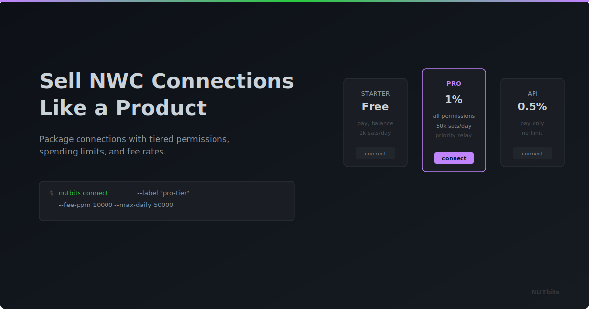

  

# Sell NWC Connections Like a Product

**One NUTbits instance. Many connections. Each one a product you can scope, price, and sell independently.**

---

## Ecash Mints Create Value. Now You Can Sell Access to It.

If you run a Cashu mint, you've already done the hard part. You set up the infrastructure, you manage the liquidity, you keep things running. People mint and melt ecash through your mint every day.

But right now, the only people who benefit are Cashu wallet users. What about the app developer who needs Lightning payment access for their project? The small shop that wants a point-of-sale system? The community that needs wallets for their members?

They'd all benefit from what your mint provides — but they don't speak Cashu. They speak NWC.

NUTbits lets you package your mint's capabilities as NWC connections and hand them out — or sell them.

## Every Connection Is a Product

NUTbits lets you create multiple NWC connections from a single instance. Each connection is independent — with its own permissions, spending limits, and fee rate.

Think of each connection as a product. You decide:

- **What it can do** — send only, receive only, or both
- **How much it can spend** — daily limits, per-payment caps
- **What it costs** — your service fee rate for that specific connection

You hand the customer a connection string. They paste it into whatever app they're using — LNBits, Alby, a Nostr client, anything that speaks NWC. And they're live.

They don't interact with your mint directly. They don't need a Cashu wallet. They just have a working payment connection backed by the ecash infrastructure you already run.

## Designing Tiers

You could structure it like any service business:

**A starter tier** — receive-only, low daily limit, higher fee. Good for people who want to try it out or have small-scale needs.

**A standard tier** — full send and receive, reasonable limits, moderate fee. Good for small merchants, freelancers, personal projects.

**A business tier** — full permissions, generous limits, lower fee because the volume makes up for it. Good for active businesses and app developers.

**Custom deals** — negotiated rates for high-volume clients or special use cases.

Each connection is self-contained. You control the terms. The customer gets exactly what they need.

## What Your Customers Experience

From their side, it's simple:

1. They get an NWC connection string from you
2. They paste it into their app
3. They send and receive Lightning payments

They might not even know what's behind it. They just have Lightning access that works. Behind the scenes, your mint handles the actual payments, NUTbits manages the ecash, and you earn a fee on every outgoing transaction.

## The Economics

Your costs are mostly fixed — you're already running the mint. NUTbits is a lightweight process on top. Your revenue scales with every new connection and every transaction flowing through.

More connections, more transactions, more revenue — same infrastructure you already maintain. That's the appeal.

## Real People, Real Use Cases

**A mint operator in Berlin** gives free connections to friends and fellow Cashu enthusiasts, sells connections to two local shops that want Lightning POS. The shop fees help cover the mint's server costs.

**A developer collective** gets a connection for their production app. They integrate Lightning payments through NWC without running any payment infrastructure. They focus on their product.

**A Bitcoin community** runs a shared mint. Members use it for ecash between themselves. Through NUTbits, the same mint also powers the community's LNBits instance — wallets for members, a Lightning address for donations, a payment page for meetup tickets.

## The Honest Part

You're running a service here. That means responsibility. Your customers depend on your mint being online and well-funded. If the mint goes down, their payments stop. If you have liquidity issues, transactions fail.

That's real. Running this well means keeping your mint solid and your communication honest when things go wrong. It's a real business with real obligations — not a set-and-forget side project.

But if you're already running a mint and doing those things anyway, selling connections is just making that effort pay for itself.

---

**Every NWC connection is a product.** Define yours, price them, and start offering access to your mint's capabilities to a wider audience.

[GitHub](https://github.com/DoktorShift/nutbits) · [CLI Guide](../CLI.md)
