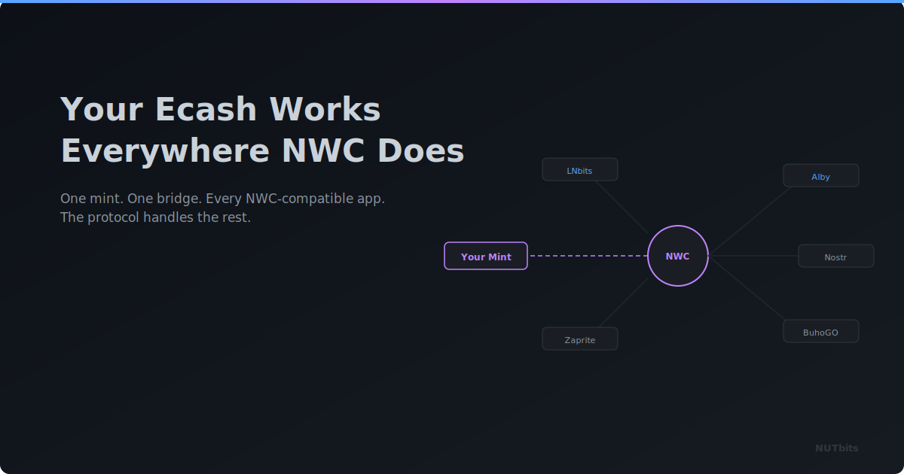

  

# Your Ecash Works Everywhere NWC Does

**If an app supports Nostr Wallet Connect, you can power it with ecash from a Cashu mint. Your sats, your mint, their app.**

---

## Ecash Deserves a Bigger Playground

If you use Cashu, you probably love it for the right reasons. Bearer tokens. Privacy by default. Instant transfers. It feels like what digital cash should have always been.

But let's be honest: the Cashu app ecosystem is still early. A handful of great wallets, a growing community, real momentum. And yet, there's a whole world of NWC-powered apps out there that you can't really plug into with ecash. Until now.

NUTbits makes your Cashu mint speak NWC. And NWC is everywhere.

## NWC Is the Universal Plug

Nostr Wallet Connect has quietly become one of the most widely supported wallet protocols. Alby uses it. Amethyst, Damus, Primal - they all support it. LNBits accepts it as a funding source. The list keeps growing.

NUTbits speaks the same NWC language all these apps expect. It can report a balance, create invoices, pay invoices, look up payment status. The full set of wallet operations.

The difference is what's behind it. Instead of connecting directly to a Lightning wallet, NUTbits connects to a Cashu mint. When an app asks to pay an invoice, the mint settles it through Lightning. When someone pays an invoice, the mint receives it and NUTbits holds the ecash.

From the app's perspective, nothing is different. It just sees a wallet. Your ecash does the rest.

## Where This Gets Interesting

### Nostr Clients

Paste your NUTbits connection string into Amethyst, Damus, or any Nostr client that supports NWC. Zap people, tip creators, pay for relay access, all backed by ecash from your mint.

Your Nostr experience stays the same. You just have a different kind of wallet behind it, one that starts with ecash.

### Browser Extensions

Alby's browser extension supports NWC. Add a NUTbits connection, and you can pay for content behind Lightning paywalls, boost podcasts, or use any website that accepts Lightning, all flowing through your mint.

### LNBits

This is the big one. Plug NUTbits into LNBits as a funding source, and you unlock the entire extension ecosystem. Point-of-sale, payment links, Lightning addresses, NFC cards, automatic payment splitting, all of it powered by ecash.

### Your Own Projects

Building something that needs payment integration? Create a NUTbits connection with the right permissions and limits, and use any NWC client library. You get a working payment backend from a connection string, backed by a mint you already trust.

## One Wallet, Many Apps

You don't need a separate setup for each app. Create a different NWC connection for each one, each with its own spending limits and permissions.

One connection for your Nostr client with a small daily limit for zaps. Another for LNBits with full permissions. A third for a side project with pay-only access.

If one connection gets compromised, revoke it without touching the others. Your ecash balance is shared, but each connection's access is isolated.

## The Privacy Angle

This is where ecash enthusiasts will appreciate what's happening. When you use NUTbits, your payments start as ecash before reaching Lightning. The Nostr relay only sees encrypted messages. The mint sees ecash operations. There's a separation between the NWC layer and the Lightning layer that doesn't exist when you connect directly to a wallet service.

It's not a silver bullet; the mint still processes the Lightning payments. But if you already trust your mint (or run your own), the privacy properties of ecash travel with you into every NWC app you use.

That's kind of the point. Ecash shouldn't be limited to Cashu wallets. It should be usable everywhere. NUTbits makes that real.

## What You Need

A Cashu mint you trust (or your own). NUTbits connected to it. And any app that supports NWC.

Create a connection, paste the string, and go. The app doesn't know ecash is involved. It just sees a wallet that works. But you know, and the properties of ecash are there, doing their thing, underneath.

---

**Your ecash works everywhere NWC does.** Pick your app, create a connection, and bring ecash with you.

[GitHub](https://github.com/DoktorShift/nutbits)
