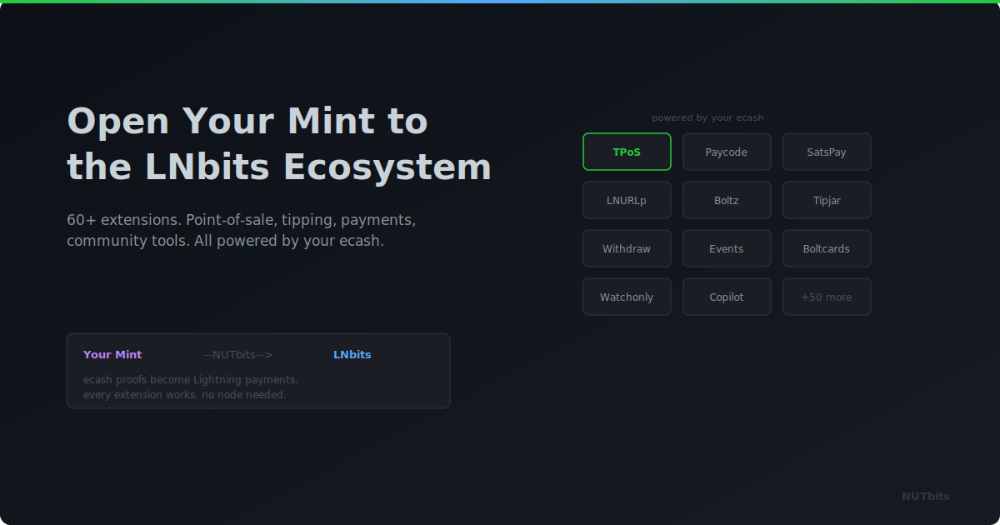

  

# Open Your Cashu Mint to the LNBits Ecosystem

**Your mint already handles Lightning. NUTbits connects it to 60+ LNBits extensions, from point-of-sale to NFC cards to automated payment splits.**

---

## Your Mint Can Do More Than Mint Ecash

Right now, your Cashu mint serves Cashu wallets. Minibits, eNuts, Cashu.me - people use them to hold and transfer ecash. That's valuable, and the Cashu wallet ecosystem is growing.

But your mint's Lightning infrastructure is capable of a lot more than just minting and melting tokens for wallet users. Every time your mint processes a Lightning payment, it's doing the same thing any funding source does: settling invoices on the network.

What if all that Lightning capability could power an entire commerce platform?

## NUTbits Bridges Your Mint to LNBits

When you connect NUTbits to your mint and plug it into LNBits as a funding source, every LNBits extension becomes available. Your mint's Lightning infrastructure now powers:

**For shops and merchants:**
- **TPoS** - a point-of-sale screen. Enter an amount, customer scans, payment done.
- **SatsPay** - payment pages you can send to customers. They click, they pay.
- **Boltcards** - NFC tap-to-pay cards. Customers tap their card, your mint settles the Lightning payment.

**For creators and communities:**
- **Lightning addresses** - yourname@yourdomain.com for receiving tips and donations
- **Splitpayments** - incoming payments automatically divided between multiple people. Perfect for collaborations, shared projects, podcasts.
- **Events** - sell tickets and accept registrations with Lightning payments

**For operators:**
- **Multi-user wallets** - give different users their own wallets on a shared instance
- **Watchonly** - keep track of on-chain wallets alongside your Lightning activity

And that's just a sample. There are 60+ extensions, and they all work because LNBits doesn't care what the funding source is; it just needs something that can pay and receive Lightning invoices.

## What Changes, What Doesn't

**What changes:** Your mint's reach. Instead of serving only Cashu wallet users, your mint now serves anyone using any LNBits extension. A shop owner using TPoS doesn't know ecash exists. They just see a point-of-sale system that works.

**What doesn't change:** Your mint. It still does the same thing it always does: processes Lightning payments, issues ecash, manages liquidity. NUTbits handles the translation. LNBits handles the user-facing features.

## A Practical Example

A Bitcoin community runs a Cashu mint. Members use it for ecash among themselves: fast, private, no fees.

They add NUTbits and LNBits. Now that same mint also powers:

- A coffee shop down the street with a **TPoS tablet** at the counter
- **Lightning addresses** for every community member
- **Splitpayments** on the community treasury, with membership contributions automatically split between server costs and event budget
- A **SatsPay page** for their quarterly meetup sponsorship

One mint. Same infrastructure. But now it's useful to a much wider audience.

## The Honest Trade-Off

Your mint is now the foundation for more activity. That's great for reach, but it also means more depends on your mint being online and well-funded.

If your mint goes down, not just ecash wallets are affected. The coffee shop's POS stops too. If liquidity runs low, LNBits extensions can't settle payments.

This is manageable. It just means taking your mint's reliability seriously. NUTbits supports multi-mint failover to help with uptime. And if you're already running a solid mint, you might not need to change much at all.

## Getting From Here to There

The setup is four steps: run NUTbits, point it at your mint, create an NWC connection, paste it into LNBits. Enable the extensions you want. Done.

Your mint is now a platform. Your ecash infrastructure now powers commerce, tipping, invoicing, NFC cards, and whatever the LNBits community builds next.

---

**Your mint already does the hard part.** NUTbits and LNBits just give it a bigger stage.

[GitHub](https://github.com/DoktorShift/nutbits) · [LNBits](https://lnbits.com)
