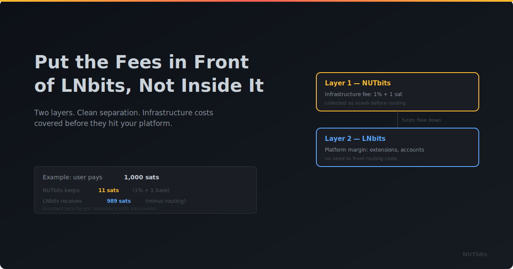

  

# Put the Fees in Front of LNBits, Not Inside It

**Charge at the funding source with NUTbits, then add your LNBits margin on top. Two layers, one clean model.**

---

## The Problem With Fees After the Fact

If you run an LNBits instance for other people, you've probably wrestled with this: you're paying the Lightning routing fees out of your own pocket, and then trying to recover those costs from users inside LNBits.

That works, but it's backwards. You front the money first and hope the fee structure makes you whole. If routing gets expensive on a particular payment, you might eat the difference. You're always playing catch-up.

What if the fee was collected **before** the payment left the building?

## NUTbits Collects at the Source

When NUTbits sits between a Cashu mint and LNBits as the funding source, it can charge a service fee on every outgoing payment. That fee is deducted at the bridge level — before LNBits even sees the transaction.

From LNBits' perspective, the payment just had a slightly higher cost. From your perspective, you just earned revenue without fronting anything.

The mint handles the Lightning routing. NUTbits takes a service fee for the bridge. You're in the green from payment number one.

## Two Layers, Both Yours

Here's another one. You can stack two fee layers:

**Layer 1 — NUTbits (funding source fee):** This covers your infrastructure costs. The mint, the liquidity, the bridge. Set a percentage, a flat fee per payment, or both. Every outgoing payment generates revenue at this layer.

**Layer 2 — LNBits (platform fee):** This is your margin for running the LNBits instance. The value you add by curating extensions, managing users, providing the platform. Configure this however LNBits lets you.

Together, you get a clean split:

- Layer 1 pays for infrastructure
- Layer 2 is your profit

Neither layer requires you to front Lightning routing costs. The mint covers routing. NUTbits covers infrastructure costs through its fee. LNBits generates your margin.

## A Simple Example

Say you set NUTbits at 0.5% and LNBits at another 0.5%. A user sends 10,000 sats:

- The mint routes the Lightning payment
- NUTbits takes ~50 sats as a service fee
- LNBits takes ~50 sats as a platform fee
- Total cost to the user: about 1% plus whatever the Lightning routing cost

You earned 100 sats. You fronted nothing. The user saw a predictable fee.

## Why This Makes Sense for Operators

**Predictable costs for users.** You control both layers, so you can set a consistent total fee. Users know what they're paying, every time. No surprise routing charges.

**No more eating routing costs.** The mint's Lightning infrastructure handles routing, and that cost is separate from your revenue. You're not gambling on routing efficiency.

**Per-connection flexibility.** With NUTbits, you can set different fee rates for different NWC connections. A community instance might get a low rate. A commercial client pays more. All from the same setup, with LNBits fees on top.

**Clean separation of concerns.** Infrastructure costs and platform margin are tracked separately. You always know which layer is earning what.

## Who Benefits From This Model

**Community operators** who run LNBits for their local meetup or online group. The two-layer model lets them cover costs without charging more than necessary.

**Hosted LNBits providers** selling Lightning-as-a-Service. They can offer tiered pricing through different NWC connections, each with its own infrastructure fee, plus a uniform platform fee in LNBits.

**Mint operators** who want to extend their mint's usefulness. Run LNBits on top, charge at both layers, and turn your mint into a sustainable business.

## The Point

Traditional LNBits hosting means fronting all the Lightning costs and hoping your internal fees recover them. NUTbits flips that. Fees are collected at the funding source, before the money enters LNBits. Then you add your platform margin on top.

Two layers. Both transparent. Both under your control.

---

**Stop fronting fees. Start earning from the first sat.** Put NUTbits in front of LNBits and let the two-layer model work for you.

[GitHub](https://github.com/DoktorShift/nutbits) · [How It Works](../HOW-IT-WORKS.md) · [LNBits](https://lnbits.com)
