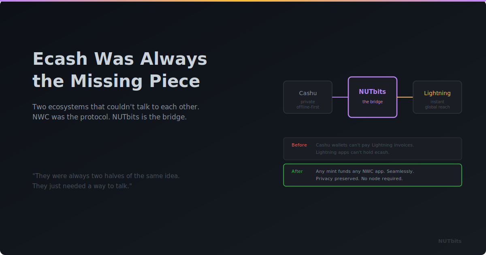

  

# Ecash Was Always the Missing Piece

**How NUTbits completes the loop between Cashu mints and the Lightning economy.**

---

When I started working with Cashu, the idea was straightforward: bring ecash to Bitcoin. Blind signatures. Bearer tokens. The kind of privacy that was discussed in cryptography mailing lists thirty years ago, applied to satoshis.

The protocol does what it's supposed to do. Mints issue tokens. Users hold them. Transfers between users of the same mint are instant, private, and free. It works. It's simple. And simplicity, in protocol design, is a feature.

But there was always a boundary.

## The Mint Lives in Its Own World

A Cashu mint is powerful within its domain. Inside the mint ecosystem, ecash moves freely. Wallets like Minibits, eNuts, and Cashu.me make that experience smooth for end users.

The moment you want to interact with the wider Lightning world, though — pay an invoice, get paid by someone outside the mint, connect to a platform that expects a wallet API — you're back to manual operations. The mint knows Cashu. The rest of the world knows Lightning. These two worlds were adjacent but didn't really talk to each other in a standardized way.

Wallet apps bridged this for individual users. But platforms, services, apps that want to build on top of Lightning programmatically? They had no clean way to plug into a Cashu mint.

## NUTbits Connects the Two

NUTbits is a bridge. It connects to a Cashu mint on one side and speaks Nostr Wallet Connect on the other. That's it. No new protocol. No custom API. Just a translation between two existing standards.

Any app that speaks NWC sees a wallet. The mint sees a Cashu client. NUTbits sits in the middle and translates.

This is a simple idea, and simple ideas tend to be the ones that matter.

## What Changes for Mints

Before NUTbits, a mint served Cashu wallets. That's a growing ecosystem, but it's still bounded by the number of apps that natively speak the Cashu protocol.

After NUTbits, a mint serves everything that speaks NWC. Every Nostr client that supports wallet connections. Every app built on the NWC standard. LNBits and its entire extension ecosystem. Any developer who knows what to do with a connection string.

The mint doesn't change. It still does exactly what it always did. But its reach expands dramatically because NUTbits makes its capabilities accessible through a protocol the rest of the world already uses.

That's meaningful. It means mint operators aren't limited to serving Cashu wallet users. Their infrastructure — the Lightning liquidity, the servers, the uptime — becomes useful to a much larger audience.

## Ecash Properties Travel With the Payments

Here's the part that matters most to me.

When you pay a Lightning invoice through NUTbits, the payment starts as ecash. The sender held bearer tokens. Not a balance in someone's database. Not a channel state. Bearer tokens.

Cashu's blind signature scheme means the mint can verify that tokens are valid, but it has limited visibility into which tokens belong to which user. That's a fundamentally different trust model than most Lightning wallet services, where the provider sees everything.

NUTbits preserves that property as far as the Cashu layer extends. Once the payment hits Lightning, it's a normal Lightning payment with normal Lightning privacy properties. But the ecash layer adds something that wasn't there before.

Is it perfect privacy? No. There are always trade-offs, and I'd rather be honest about them than oversell. But it's a meaningful improvement over handing all your payment data to a custodial service.

## For Mint Operators

If you run a mint, NUTbits gives your infrastructure a new dimension.

You can offer NWC connections to people who need Lightning access. You can charge service fees that make your operation sustainable. You can power LNBits instances. You can support apps and developers who build on NWC.

One mint. One NUTbits instance. Many connections, each with its own permissions, limits, and pricing.

That's an infrastructure service built on top of an ecash mint. It's a new model, and it's only possible because someone built the peaces this Bride is connecting the bridge.

## The Flywheel

Cashu and Lightning are complementary. Ecash for privacy and instant transfers within a trust domain. Lightning for interoperability and network reach. Each strong where the other is weaker.

NUTbits doesn't merge them. It connects them. It lets ecash flow into Lightning and Lightning flow into ecash, through a standard protocol that apps already support.

More mints running NUTbits means more NWC endpoints in the world. More NWC endpoints means more developers building for NWC. More NWC apps means more reasons to run a mint.

That's a flywheel.

## The Code

NUTbits is open source. It's built by DoktorShift, using the same Cashu primitives the community has been developing together. It supports multi-mint failover, encrypted state, per-connection fees, and a CLI for management.

If you run a mint — try it. If you build NWC apps — test against it. If you want to bring ecash into the wider Lightning ecosystem — this is a good place to start.

---

**[GitHub](https://github.com/DoktorShift/nutbits)**
