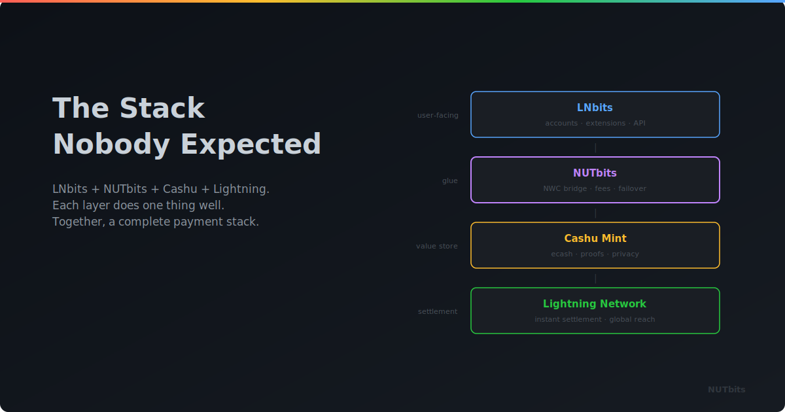

  

# The Stack Nobody Expected

**What happens when you combine a Lightning accounts system with an ecash bridge, and why it matters more than either one alone.**

---

There's a pattern in open source Bitcoin tooling that's easy to miss if you're not paying attention. Individual projects are useful on their own. But when two of them click together in the right way, something new emerges, something neither project could do alone.

NUTbits and LNBits are one of those combinations.

## LNBits Already Changed the Game

LNBits turned Lightning into a platform. Before LNBits, if you wanted a point-of-sale system, a tipping page, a Lightning address, or an NFC payment card, you needed separate solutions for each. LNBits said: what if one system could do all of that, and what if anyone could add new capabilities through extensions?

That idea worked. Today there are over sixty extensions. Communities run LNBits for their members. Merchants use it at the counter. Developers build on its APIs. It's become infrastructure that people depend on.

But LNBits has always needed something underneath it: a funding source. And that funding source shaped what was possible.

## The Funding Source Shapes Everything

Think about it. If your funding source is an LND node you manage yourself, your LNBits instance is as reliable as your skills with that node. If it's a hosted service, you're dependent on that service's uptime and terms. If it's Phoenixd, you get simplicity but with its own trade-offs.

Every funding source brings a different set of properties. Different trust models, different operational requirements, different strengths.

NUTbits introduces a funding source with a shape that didn't exist before: one backed by ecash from a Cashu mint. And for people who are already in the ecash world, that changes what LNBits can be.

## New Scenarios That Actually Work Now

**The ecash community that wants more.** A group of Cashu enthusiasts share a mint. They use it for private transfers between each other. It's great, but limited to Cashu wallets. They add NUTbits and LNBits, and suddenly the same mint powers Lightning addresses for every member, a payment page for meetup tickets, and a TPoS for the bar that hosts them. Their ecash world just got a lot bigger, without leaving it.

**The mint operator who wants to build on top.** You run a Cashu mint. You've seen what LNBits can do and wondered: what if my mint could power all that? With NUTbits, it can. Your mint becomes the backend for sixty-plus extensions. Your ecash infrastructure now serves people who've never opened a Cashu wallet.

**The developer who thinks in ecash.** You're building something and you like the properties of Cashu: bearer tokens, blind signatures, the privacy model. But you also need Lightning integration for the real world. NUTbits gives you a bridge. Build on ecash, reach Lightning, use LNBits extensions where they help.

**The tinkerer.** You just want to see what happens when you plug a Cashu mint into LNBits. You've been in both ecosystems. You want to see them talk to each other. That curiosity is valid, and NUTbits is how you scratch that itch.

## Separation of Concerns, for Real

There's something elegant about how this stack separates responsibilities.

The **Cashu mint** handles Lightning. It manages routes, payments, maintains liquidity. That's its job.

**NUTbits** handles the bridge. It translates between ecash and NWC, manages connections, collects service fees. That's its job.

**LNBits** handles the user experience. Wallets, extensions, multi-tenant accounts, the admin panel. That's its job.

Each layer does one thing well and doesn't need to know much about the others. The mint doesn't know LNBits exists. LNBits doesn't know ecash is involved. NUTbits connects them without either side needing to change.

That kind of clean separation means each project can evolve independently. LNBits can add new extensions. Mints can upgrade their backend. NUTbits can improve its bridging. Nobody's waiting on anybody else.

## The Fee Model That Makes Sense

One underrated benefit of this stack: it finally gives ecash operators a clean way to sustain the whole thing.

NUTbits charges a service fee at the funding source level. LNBits can charge a platform fee at the application level. Two layers, both transparent, both configurable.

The mint operator earns for providing the ecash and Lightning infrastructure. The LNBits operator earns for providing the platform. Users pay a clear, predictable fee for a service they actually use.

It's a straightforward value exchange: you provide something useful, you charge fairly for it.

## What LNBits Gets From This

A new audience. People in the Cashu ecosystem who weren't thinking about LNBits now have a reason to. Every ecash enthusiast who uses NUTbits with LNBits is also a LNBits user, which means more instances in the world, more feedback, more extension development.

It also means more funding source diversity. LNBits already supports several backends. NUTbits adds one with a different trust model and different properties. More options are good for the ecosystem.

## What NUTbits Gets From This

Reach. LNBits has a large and active user base. The integration gives NUTbits a clear, high-value use case. "Bridge ecash to NWC" is abstract. "Power your LNBits instance with a Cashu mint" is concrete and immediately useful.

It also grows the Cashu ecosystem. Every LNBits instance running on NUTbits is an instance running on ecash. That's more volume through mints, more reasons to run mints, more reasons to build Cashu tools.

## What Both Get Together

Something neither has alone: a complete, end-to-end Bitcoin payment stack that starts with ecash and ends with whatever LNBits extensions your users need.

Cashu provides the privacy and the settlement layer. NUTbits provides the protocol bridge and the fee layer. LNBits provides the user experience and the extension ecosystem.

Together, you get a platform that a community can run, a merchant can use, a developer can build on, and an operator can sustain, with ecash flowing through the whole thing.

## Try It

If you already run LNBits, adding NUTbits is one connection string away. Point it at a mint, plug it in, see what happens.

If you already run a Cashu mint, NUTbits and LNBits extend your mint's usefulness to an audience you weren't reaching before.

If you're in both worlds and wanted them to talk to each other, this is how.

Some things are better together.

---

**[NUTbits on GitHub](https://github.com/DoktorShift/nutbits)** · **[LNBits](https://lnbits.com)**
