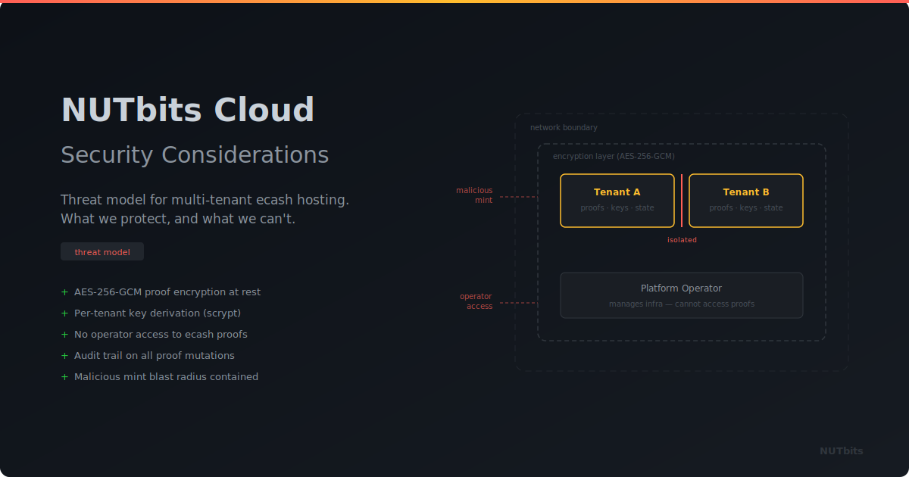

  

# NUTbits Cloud — Security Considerations

> Internal document. Things to think through before building the multi-tenant platform.

---

## The Core Problem

In single-tenant NUTbits, you're the only user. Your keys, your proofs, your mint. If something goes wrong, you're only hurting yourself.

In multi-tenant NUTbits Cloud, the platform holds ecash proofs and private keys for **many users**. That changes the threat model completely. The platform becomes a high-value target because compromising it means accessing every user's ecash.

---

## 1. Ecash Proof Storage — The Biggest Target

### What's at risk
Cashu proofs are bearer tokens. Whoever holds them can spend them. In the current NUTbits architecture, all proofs sit in one encrypted state file (or database). In a multi-tenant setup, the platform stores proofs for every user.

If an attacker gets access to the proof storage, they can drain every user's balance. Unlike Lightning channels where you need keys AND a node to steal funds, ecash proofs are self-contained — copy them, spend them, gone.

### Things to think about
- **Proofs must be isolated per user.** Not just logically separated in one database, but meaningfully isolated. If one user's data leaks, other users must not be affected.
- **Encryption at rest per user.** Each user's proofs encrypted with a different key. A single master key for the whole database is a single point of failure.
- **Who holds the decryption keys?** If the platform holds them (to process payments), the platform can always access proofs. If the user holds them, the platform can't process payments without the user being online. This is a fundamental tension.
- **Consider a model where the platform never sees raw proofs at rest.** Proofs are decrypted in memory only during payment processing, then re-encrypted immediately. Limits the window of exposure.

### The honest truth
A multi-tenant platform that processes payments on behalf of users **will** have access to their proofs during processing. There's no way around that — NUTbits needs the actual proof data to melt ecash. The question is: how short can we make the exposure window, and how hard can we make bulk extraction?

---

## 2. Private Key Management — NWC Signing Keys

### What's at risk
Every NWC connection has a Nostr keypair (`app_privkey`). The platform signs NWC responses with these keys. In multi-tenant, the platform holds private keys for every connection of every user.

If the key store is compromised, an attacker can impersonate any NWC connection — sign fake responses, intercept commands, redirect payments.

### Things to think about
- **Key storage must be separate from proof storage.** Compromising one shouldn't automatically give access to the other.
- **Consider HSM or key derivation.** Instead of storing raw private keys, derive them from a master secret + user ID + connection ID. The master secret can live in an HSM or secure enclave. Individual keys never touch disk.
- **Key rotation.** Can users rotate their NWC keys without breaking existing connections? NWC protocol doesn't really support this cleanly, but worth thinking about for long-lived connections.
- **Revocation must be instant.** When a user revokes a connection, the key must be dead immediately. No race conditions, no cached keys still signing responses.

---

## 3. User Isolation — Tenant Boundaries

### What's at risk
In a multi-tenant system, one user's actions must never affect another user. This sounds obvious but gets tricky in practice.

### Things to think about
- **Proof confusion.** Proofs are tied to specific mints. If two users use the same mint, their proofs look similar. The system must never accidentally assign User A's proofs to User B or spend User A's proofs for User B's payment.
- **Resource exhaustion.** One user flooding the system with connections or payments shouldn't degrade service for others. Rate limiting per user, not just globally.
- **Transaction history isolation.** User A must never see User B's transactions, balances, or connection details. Even in error messages or logs.
- **Relay subscriptions.** Each connection subscribes to Nostr relays. Hundreds of users with multiple connections each means thousands of relay subscriptions. If they share relay connections (for efficiency), ensure event routing is airtight — User A's NWC events must never be processed by User B's handler.
- **Log sanitization.** Multi-tenant logs are dangerous. A log entry with proof data, NWC strings, or payment details must never leak across user boundaries. Current NUTbits masks NWC strings in logs, but multi-tenant needs much stricter rules.

---

## 4. Malicious Mints — Users Bring Their Own

### What's at risk
Users supply their own mint URL. The platform connects to it and trusts it for ecash operations. A malicious mint could try to attack the platform.

### Things to think about
- **A mint could return garbage proofs** that look valid but aren't. The platform would store them, report a balance, but payments would fail. Not directly a security issue, but it degrades user trust in the platform.
- **A mint could hang or timeout** on melt operations, tying up platform resources. Need strict timeouts and circuit breakers per mint.
- **A mint could return crafted responses** designed to exploit parsing bugs in the Cashu library or NUTbits itself. Input validation on everything coming from mints.
- **A mint could log which NUTbits instance is connecting** and correlate traffic. This is a privacy concern for the platform and its users.
- **SSRF risk.** The user provides a mint URL. What if they provide `http://localhost:3000` or an internal network address? The platform would make HTTP requests to attacker-controlled or internal destinations. **Must validate and restrict mint URLs** — only HTTPS, no private IP ranges, no localhost, no link-local addresses.
- **DNS rebinding.** A mint URL resolves to a public IP initially (passes validation), then switches DNS to an internal IP. Platform's subsequent requests hit internal services. Need to pin DNS or re-validate on every request.
- **Mint allow-listing vs. open access.** Safest: only allow known, vetted mints. Most flexible: allow any mint. Middle ground: allow any mint but with warnings, lower limits, and extra monitoring for unvetted mints.

---

## 5. Authentication & Session Security

### Things to think about
- **How do users log in?** Email + password? Nostr key (NIP-07)? Lightning auth (LNURL-auth)? Each has trade-offs. Nostr or Lightning auth avoids storing passwords but requires users to have those tools.
- **Session hijacking.** If someone steals a session token, they can create connections, view balances, see NWC strings. Sessions must be short-lived, bound to IP or fingerprint, and revocable.
- **NWC string exposure.** The web UI displays NWC connection strings. These are bearer credentials — anyone who sees them can use the connection. The UI should treat them like passwords: show once, require confirmation to reveal again, warn about copying.
- **CSRF on connection creation.** An attacker tricks a logged-in user into visiting a page that creates a new connection with attacker-controlled parameters. Standard CSRF protections needed.
- **API authentication.** If there's a management API (there should be), it needs proper auth tokens, rate limiting, and scope restrictions.

---

## 6. Platform Fee Collection — Where Do the Sats Go?

### What's at risk
The platform earns a service fee on every payment. Those fees are collected as ecash from the user's mint. But the platform needs to actually **hold and eventually spend** those sats.

### Things to think about
- **Fee proofs accumulate.** The platform collects small ecash proofs from many different mints (since each user brings their own). That's a lot of small-denomination proofs across many mints. Managing this is complex.
- **Minting risk.** The platform holds ecash from mints it doesn't control. Any of those mints could go down, rug, or become insolvent. The platform's revenue is only as good as the mints it's collected from.
- **Sweep strategy.** The platform should regularly sweep fee proofs — melt them via Lightning to a wallet it controls. Don't accumulate large ecash balances on untrusted mints. Take the Lightning routing cost as a cost of doing business.
- **What if a mint blocks the platform?** If a mint doesn't want NUTbits Cloud connecting to it, they could block the platform's IP. The platform should handle this gracefully — notify the affected user, not crash.
- **Fee proofs must be stored separately from user proofs.** If the platform's fee wallet is compromised, user proofs must not be affected, and vice versa.

---

## 7. Denial of Service & Abuse

### Things to think about
- **Account spam.** Someone creates thousands of accounts, each with connections to bogus mints, generating relay subscriptions and resource usage. Need rate limiting on account creation, proof of work, or payment-to-register.
- **Relay flooding.** Each connection subscribes to Nostr relays. An attacker creates many connections to flood relay infrastructure. Cap connections per account, especially on free tiers.
- **Payment spam.** Tiny payments in a loop to generate fee calculations and storage writes without meaningful revenue. Minimum payment amounts help.
- **Mint URL abuse.** Submitting thousands of different mint URLs to force the platform to connect to many endpoints. Rate limit new mint URLs per account.
- **State bloat.** Each user accumulates proofs, transactions, connection records. Without cleanup policies, storage grows forever. Need archival, proof consolidation, and history limits.

---

## 8. Operational Security — The Platform Itself

### Things to think about
- **Server compromise.** If the server is breached, everything is exposed — proofs, keys, user data. Defense in depth: encrypted storage, minimal data in memory, monitoring for unusual proof spending, alert on bulk proof access.
- **Insider threat.** The platform operator (you) technically has access to everything. For user trust, consider: can you design it so that even you can't easily extract user proofs? Client-side encryption with server-side processing is hard, but partial approaches might help.
- **Backups contain secrets.** Database backups contain ecash proofs. If backups leak, funds leak. Backups must be encrypted, access-controlled, and regularly tested.
- **Logging.** Logs must never contain proof data, NWC secrets, private keys, or raw ecash amounts traceable to specific users. Current NUTbits masks NWC strings — multi-tenant needs this everywhere.
- **Deployment.** Containers, secrets management, network isolation between the web UI, the bridge workers, and the databases. The web UI should not have direct access to proof storage.
- **Dependency supply chain.** The Cashu library, Nostr libraries, crypto libraries — any compromised dependency could exfiltrate proofs. Pin dependencies, audit updates, consider reproducible builds.

---

## 9. Legal & Compliance Considerations

### Things to think about
- **Are you a custodian?** The platform holds ecash on behalf of users. In many jurisdictions, that makes you a custodial service. Even though the user's mint handles Lightning, the platform holds the bearer tokens. This might have regulatory implications depending on where you operate.
- **Data retention.** Transaction history, connection metadata, IP addresses — what do you store, for how long, and who can access it? GDPR if serving EU users.
- **Terms of service.** Clear terms about: the platform holds ecash (custodial risk), mints can fail (mint risk), and fees are non-refundable. Users need to understand what they're signing up for.
- **Liability if funds are lost.** If a bug, a hack, or a mint failure causes users to lose ecash, what's the platform's responsibility? This needs to be clear upfront.

---

## Priority Assessment

When we actually tackle this, here's a suggested order:

**Must solve before launch:**
1. Per-user proof isolation and encryption
2. SSRF prevention on mint URLs
3. Tenant boundary enforcement (proofs, keys, logs, events)
4. Authentication and session security
5. NWC key storage security

**Must solve before scaling:**
6. Fee proof sweep strategy
7. Rate limiting and abuse prevention
8. Relay subscription management at scale
9. Backup encryption and access control

**Must think about seriously:**
10. Custodial status / legal implications
11. Insider threat mitigation
12. Dependency supply chain

---

*This isn't a complete threat model — it's a starting point. Each section needs deeper analysis when we actually build. The key takeaway: multi-tenant ecash handling is fundamentally different from single-tenant. Bearer tokens + many users = high-value target. Design for breach, not just prevention.*
