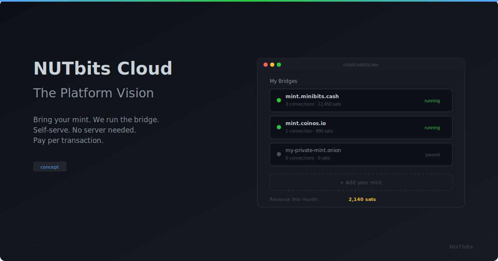

  

# NUTbits Cloud — The Platform Vision

**What if anyone could bridge their Cashu mint to NWC without running NUTbits themselves?**

---

> This is an internal concept document. Not for publication yet — waiting for community feedback on NUTbits before building.

## The Idea

A hosted web platform where users bring their own Cashu mint and get NWC bridge capabilities without running any software.

The user:
1. Signs up at the platform
2. Enters their mint URL
3. Creates and manages their own NWC connections through a simple web UI
4. Gets NWC strings they can use anywhere — LNBits, Nostr clients, any NWC app
5. Manages permissions, spending limits, labels — all self-service

The platform operator:
- Runs and maintains the multi-tenant NUTbits infrastructure
- Earns revenue on every payment flowing through the platform
- Doesn't touch individual user setups — fully self-service

## What the User Gets

Everything NUTbits offers, without running it:

- Bridge any Cashu mint to NWC
- Create multiple NWC connections per mint
- Per-connection permissions and spending limits
- Use those connections with LNBits, Alby, Nostr clients, any NWC app
- Transaction history, balance overview, connection management
- All through a clean web interface

The user's mint, the user's liquidity, the user's trust model. The platform just provides the bridge.

## The Open Question: How Does the Platform Earn?

The user's mint handles Lightning payments. The user's ecash funds the transactions. The platform provides the bridge infrastructure. How does the platform take a cut?

### Option A — Platform service fee on every payment

NUTbits already has a service fee system (PPM + base fee). In the multi-tenant version, the platform operator sets a global platform fee that applies to all users. Every outgoing payment through the platform generates revenue.

**How it works:** User sends 10,000 sats → platform takes e.g. 0.5% (50 sats) → mint processes the rest.

**Pro:** Simple, automatic, scales with usage. Users who transact more pay more. Aligns cost with value.
**Con:** The fee is deducted from the user's ecash. The platform needs to hold/collect those sats. Needs clear communication so users know the rate upfront.

### Option B — Users set their own service fee, platform takes a share

Users configure their own service fees (for their downstream NWC connections). The platform takes a percentage of whatever the user earns.

**How it works:** User charges their connections 1% → platform takes 20% of that fee revenue → user keeps 80%.

**Pro:** Users who monetize their connections share the revenue. Platform earns more when users earn more. Feels fair.
**Con:** If a user sets their fee to zero, the platform earns nothing. Need a minimum platform fee as a floor.

### Option C — Flat subscription / monthly fee

Users pay a fixed amount (sats/month) to use the platform. No per-transaction fees.

**How it works:** User pays X sats/month for access. Unlimited connections and transactions.

**Pro:** Predictable revenue. Simple to understand. No per-payment overhead.
**Con:** Doesn't scale with usage. A whale and a casual user pay the same. Harder to price correctly.

### Option D — Hybrid: small platform fee + optional user fee

The platform charges a small mandatory fee (e.g. 0.2% or a few sats per payment) on every transaction. On top of that, users can set their own service fees for their connections.

**How it works:** Every payment → platform takes a small cut. Users optionally add their own fee on top for their connections.

**Pro:** Platform always earns regardless of user fee settings. Users can still monetize their connections. Both sides benefit from volume.
**Con:** Slightly more complex to explain. Two fee layers visible to end users.

### Option E — Freemium with premium tiers

Basic access is free (limited connections, limited daily volume). Premium tiers unlock more connections, higher limits, lower platform fees, priority infrastructure.

**How it works:** Free tier: 2 connections, 10k sats/day, 1% platform fee. Paid tier: unlimited connections, higher limits, 0.3% fee.

**Pro:** Low barrier to entry. Free tier drives adoption. Paid tier captures serious users.
**Con:** Free users cost infrastructure without generating revenue. Need enough paid users to cover costs.

## Recommendation (TBD after feedback)

Option D (hybrid) feels strongest. A small mandatory platform fee ensures every payment generates revenue. Users can add their own fee on top if they want to monetize downstream. The platform earns whether or not users charge their connections.

But this needs validation. Talk to potential users first. What would they pay? What feels fair? What's the competition charging (if any)?

## Architecture Notes (High Level)

What changes from current NUTbits:

- **Multi-tenant wallet management** — wallet pool per user/mint, not global
- **Per-connection mint binding** — each connection tied to a specific mint URL
- **User accounts** — authentication, user-scoped data, self-service management
- **Web UI** — connection creation, management, fee tracking, balance overview
- **Platform fee layer** — separate from user service fees, applied globally
- **Isolated state** — each user's ecash proofs stored separately

What stays the same:

- Core Cashu bridge logic (mint, melt, proof management)
- NWC protocol implementation
- Connection permission model (permissions, limits, labels)
- Fee calculation logic (just needs a platform fee layer on top)

## Who This Is For

- Mint operators who want to offer NWC access to their users without running NUTbits
- Developers who want quick NWC endpoints for their apps
- Communities that want to share a mint's capabilities through a managed platform
- Anyone who wants the NUTbits experience without the ops

## What Needs to Happen First

1. Ship NUTbits v1 and get real-world feedback
2. Validate demand — do people actually want hosted NUTbits?
3. Validate pricing — what fee model would users accept?
4. Design the multi-tenant architecture
5. Build the web UI
6. Beta with trusted users

---

*This concept is parked until NUTbits gets community traction and feedback. The foundation needs to be solid before building a platform on top of it.*
