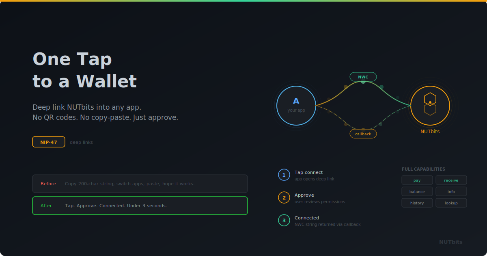

<p align="center">
  
</p>

# One Tap to a Wallet

**Deep link NUTbits into your app. Your users get a working NWC wallet in one tap - no QR codes, no copy-paste, no friction.**

---

## The Last Piece of Friction

NWC connections work. You create one, you paste the string into an app, and you have a wallet. But that "paste the string" step is where the UX breaks.

Think about what it actually looks like. Open NUTbits. Create a connection. Copy a 200-character string. Switch to the other app. Find the NWC settings. Paste. Hope you got the full string. Confirm.

Or worse: scan a QR code from one screen while looking at another screen. On the same phone.

This is the kind of thing that technically works but practically stops people. If you've ever watched someone try to set up an NWC connection for the first time, you know. The protocol is solid. The onboarding is not.

## What If You Could Just Tap a Button?

NIP-47 defines a deep link protocol that solves this. The spec has been sitting there, waiting for wallets to implement the receiving side. NUTbits now does.

Here's what it looks like from the user's perspective:

1. They tap "Connect Wallet" in your app
2. NUTbits opens with an approval screen showing your app's name and icon
3. They review the permissions and tap "Approve"
4. They're back in your app, connected

That's it. No strings copied. No QR codes scanned. No switching between apps to paste things. One tap to open, one tap to approve, done.

## How It Works Under the Hood

Your app opens a URL:

```
https://nutbits.example.com/connect?appname=YourApp&appicon=https://...&callback=yourapp://nwc
```

Three parameters. The app's name, an icon for the approval screen, and a callback URI where NUTbits should send the NWC pairing code when the user approves.

NUTbits catches the request, shows a full-screen approval view — the user sees who's asking, what permissions they're granting, and can optionally set spending limits. All the information they need to make an informed decision, presented cleanly.

When they approve, NUTbits creates the connection using the same infrastructure it always uses. Same keypair generation, same relay subscriptions, same API. Then it opens the callback URI with the NWC string as a parameter. Your app picks it up, and the connection is live.

No new backend. No new protocol. Just a URL that triggers an approval flow and returns a connection string.

## What the User Actually Sees

The approval screen is purpose-built for this moment. It shows:

- **Who's asking** — app name and icon from the deep link, so the user knows exactly what they're approving
- **What they're granting** — all six NWC capabilities listed individually with descriptions, each one toggleable
- **Optional limits** — max per-payment and daily spending caps, collapsed by default for power users
- **Which mint** — if multiple mints are configured, the user can choose

After approval, a metadata card confirms what was created: the connection label, pubkey, permission count, mint, and any limits set. Then the redirect happens.

The whole thing takes about three seconds. Most of that is the user reading and tapping approve.

## For App Developers

Integration is minimal. You need to construct a URL and handle a callback.

**Web app:**

```javascript
var params = new URLSearchParams({
  appname: 'My App',
  appicon: 'https://myapp.com/icon.png',
  callback: window.location.origin + '/nwc-callback',
})

window.location.href = `${nutbitsUrl}/connect?${params}`
```

On your callback route, grab the `value` query parameter. That's the NWC pairing string, ready to use.

**Mobile app:**

```
nostrnwc://connect?appname=MyApp&appicon=https%3A%2F%2F...&callback=myapp%3A%2F%2Fnwc
```

Register your app's URI scheme to handle the callback. When NUTbits opens it, parse the `value` parameter.

That's the entire integration. No SDK, no library, no dependency. Just URLs.

## The Connection Is Real

This isn't a simplified or limited connection. What comes back through the deep link is a full NWC pairing string, identical to what you'd create manually through the connections page.

The user gets to choose which permissions to grand. All six NWC capabilities are available:

- **Pay Invoice** — send payments
- **Make Invoice** — create invoices to receive
- **Get Balance** — check the wallet balance
- **List Transactions** — view payment history
- **Get Info** — read wallet metadata
- **Lookup Invoice** — check invoice status

They can toggle any of these off before approving. They can set spending limits. The connection is bound to a specific mint. It can be revoked later from the connections page like any other connection.

Nothing is sacrificed for convenience. The user has full control over what they're granting, presented in a way that's easy to understand and quick to act on.

## Why This Matters for Ecash

Every friction point in onboarding is a place where people drop off. The deep link removes the biggest one for NWC connections. That matters for NUTbits specifically because of what's behind these connections: ecash from a Cashu mint.

Every connection created through a deep link is another app running on ecash. Another user whose payments start as bearer tokens before reaching Lightning. Another piece of the ecash ecosystem that just works without the user needing to know the details.

The easier it is to create connections, the more connections get created. The more connections, the more ecash flows through the system. The more ecash flows, the more useful mints become.

It starts with removing a copy-paste step. It ends with more of the world running on ecash.

## What You Need

A NUTbits instance connected to a Cashu mint. An app that can open a URL and handle a callback. That's the entire requirement list.

The deep link connect page ships with NUTbits no extra setup needed. It works in browsers, as a PWA, and through the `nostrnwc://` protocol handler for native apps.

Build the URL, open it, let the user approve. They get a wallet. You get a connected user. The mint gets another connection flowing ecash. Everybody wins.

---

**One tap. Full NWC. Powered by ecash.**

[GitHub](https://github.com/DoktorShift/nutbits) · [Deep Link Docs](docs/NWC-DEEPLINK-INTEGRATION.md)
