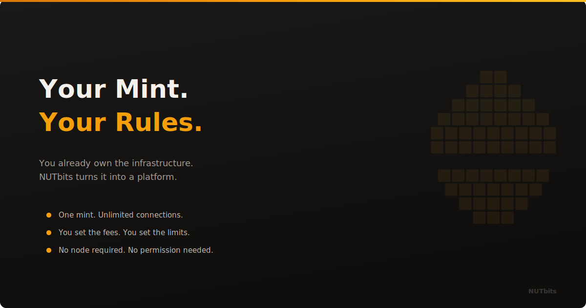

  

# Your Mint. Your Rules.

**You run a Cashu mint. You built the thing. NUTbits lets you do something with it.**

---

## You Already Did the Hard Part

Running a mint is not trivial. You set up the server. You connected a Lightning backend. You manage liquidity, uptime, backups. You deal with the stuff most people never think about.

And what do you get for it? A handful of users sending ecash between wallets.

That is fine. But you built more than a wallet backend. You built infrastructure. Real, working, Lightning-connected infrastructure. And right now, most of that capacity sits idle.

## NUTbits Puts Your Mint to Work

NUTbits connects your mint to the NWC protocol. That single connection opens the door to every app that speaks Nostr Wallet Connect. LNbits is the big one. Sixty-plus extensions. Multi-tenant accounts. Point of sale. Lightning addresses. NFC cards. Tipping pages. Invoicing. All of it, powered by ecash from your mint.

You do not need to run a Lightning node yourself. Your mint already talks to Lightning. NUTbits just translates that into a language the rest of the ecosystem understands.

## You Control Everything

Every NWC connection you hand out is scoped. You decide the spending limit. You decide the fee. You decide who gets access and for how long.

Want to give a friend unlimited access? Do it. Want to sell capped connections at 1% fee to strangers? Do that too. Want to run a whole LNbits instance for your local community and fund it entirely from your mint? Nothing stops you.

This is not someone else's platform. There is no dashboard you log into. No approval process. No terms of service that change on a Tuesday. You run NUTbits on your machine, pointed at your mint, with your rules.

## The Freelancer Math

Say you charge a 1% service fee. Someone routes 100,000 sats through your bridge today. That is 1,000 sats. Not life-changing. But it is yours. And it came from infrastructure you already operate.

Scale that to ten connections. Twenty. A small community. A merchant. A developer who needs a test backend. The numbers start to matter. Not because any single connection is huge, but because the cost of serving them is close to zero. Your mint is already running. NUTbits just opens more doors to it.

You are not building a startup. You are monetizing infrastructure you already paid for.

## What This Looks Like in Practice

You run a mint. You install NUTbits. You create a connection string. You paste that into LNbits as a funding source. Done.

From that moment, every wallet and extension inside that LNbits instance settles through your mint. Ecash goes in, Lightning comes out. The people using LNbits do not know ecash is involved. They just see a working wallet.

And you see sats flowing through your infrastructure, with a cut that you defined.

## No Gatekeepers

Nobody can shut this down. Your mint is yours. NUTbits is open source, running on your hardware. The NWC relay is a Nostr relay. The whole stack is sovereign, all the way down.

If your current hosting goes away, you move it. If a relay goes down, you switch. If you want to change your fee structure at 3am on a Sunday, you do. There is no ticket to file. No support chat. No waiting.

This is what self-sovereign infrastructure actually feels like when it works.

## Start Small

You do not need to plan a business around this. Start with one connection. Give it to yourself. Use it with LNbits. Watch the sats flow through. Understand how it feels.

Then give one to a friend. Then maybe sell one. See what happens.

The mint is already running. NUTbits just asks: what else can it do?

---

**[NUTbits on GitHub](https://github.com/DoktorShift/nutbits)** · **[LNBits](https://lnbits.com)**
