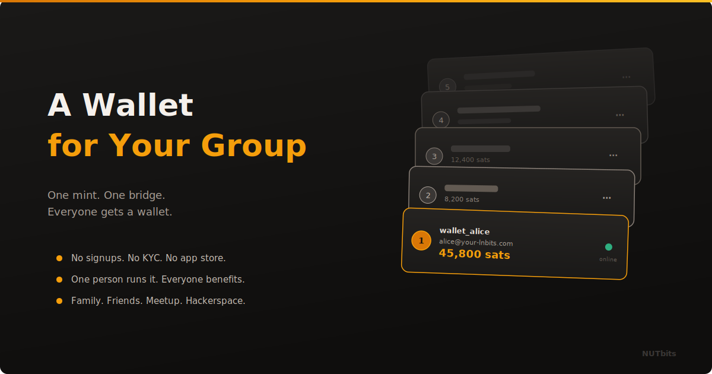

  

# A Wallet for Your Group

**One person sets it up. Everyone else just gets a wallet. No accounts. No installs. No explanations.**

---

## The Problem With Onboarding People

You know how Bitcoin works. Your friends do not. Your family definitely does not. And every time you try to get someone started, the same thing happens.

Download this app. Write down these words. No, all twelve. Now scan this. No, the other one. Wait for it to sync. Okay now you need inbound liquidity. What is that? Never mind, let me just send you some sats the old way.

It is exhausting. And it does not work. People do not adopt tools that need a 20-minute tutorial before the first transaction.

## What If You Just Handed Them a Wallet?

That is what NUTbits makes possible. You run a Cashu mint. You connect NUTbits. You spin up LNbits on top. And then you create wallets for your people.

Lightning addresses. Done. They can receive sats from anywhere in the world. A friend sends them a tip from Wallet of Satoshi? It arrives. Someone zaps them on Nostr? It arrives. A merchant sends a refund? It arrives.

They do not need to understand ecash. They do not need to know what NWC is. They do not need to run anything. You did that part.

## Who This Is For

**Your family.** Set up a wallet for each person. Suddenly your family has a private payment network. Send sats between each other instantly. Zero fees internally. The kids get allowance in sats. Grandma gets a Lightning address. Nobody needed to pass a KYC check.

**Your friend group.** Split bills. Settle bets. Send sats for picking up the tab. Everyone has a wallet that works with any Lightning app. You manage it. They use it.

**Your local meetup.** Twenty people show up every month. Half of them have never held sats. You create twenty wallets before the meetup starts. Hand out the links. By the end of the night, people are sending sats to each other across the room. That is an onboarding experience that actually sticks.

**Your hackerspace.** A shared payment infrastructure for the space. Members can accept donations, sell workshop tickets, run a vending machine. All connected to one mint. All managed through one LNbits instance.

## The Math Is Simple

One mint. One NUTbits instance. One LNbits instance. That is the entire backend.

From there, you can create as many wallets as you want. Each wallet gets its own balance, its own Lightning address, its own transaction history. LNbits handles the multi-tenant part. NUTbits handles the ecash-to-Lightning part. The mint handles the money.

You are not a bank. You are the person who set up the WiFi router so everyone can get online.

## What It Costs You

Your mint is already running. NUTbits is free and open source. LNbits is free and open source. The only cost is the server, which you probably already have.

If you want to cover that cost, set a small service fee in NUTbits. Half a percent. One percent. Whatever feels right. Every transaction through the bridge contributes a few sats toward keeping the lights on. Your users probably will not even notice, and if they do, they will understand.

## What Your People Actually See

A wallet. That is it.

They open a link. They see a balance. They can send. They can receive. They have a Lightning address. If you set up the TPoS extension, they can accept payments at a counter. If you set up LNURLp, they can put a QR code on their website.

The ecash layer is invisible. The NWC layer is invisible. The mint is invisible. All they see is a wallet that works.

## Start With One Person

You do not need to plan this for fifty users on day one. Start with yourself. Make a wallet. Use it for a week. Then make one for someone close to you. See how it goes.

The stack is built to grow, but it does not require scale. One wallet is just as valid as a hundred.

The point is not to build a platform. The point is to give someone a wallet without making them read a whitepaper first.

---

**[NUTbits on GitHub](https://github.com/DoktorShift/nutbits)** · **[LNBits](https://lnbits.com)**
