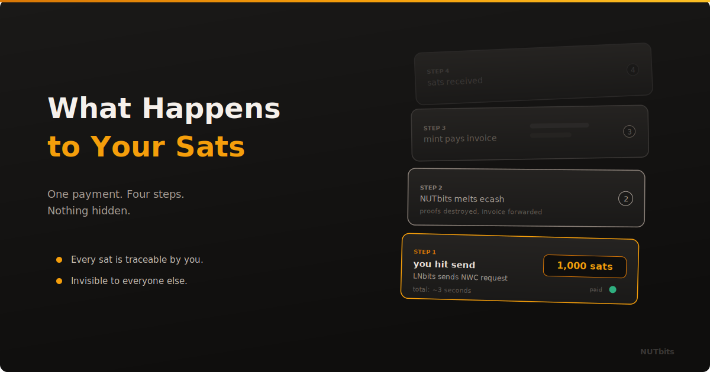

  

# What Happens to Your Sats

**Follow one payment from the moment you hit send to the moment it arrives. No magic. No black boxes. Just the path your sats actually take.**

---

## You Hit Send

Someone sent you an invoice. Maybe a friend. Maybe a shop. Maybe a Lightning address you found on Nostr. You paste it into your LNbits wallet and hit pay.

That is the last thing you see. A spinner, then a green checkmark. Done.

But between that tap and that checkmark, four things happened. And unlike most payment systems, you can actually understand all of them.

## Step 1: LNbits Sends an NWC Request

Your LNbits instance does not hold a Lightning node. It holds a connection string. That string points to NUTbits through a Nostr relay.

When you hit pay, LNbits wraps the invoice in an NWC message and sends it through that relay. Encrypted. Only NUTbits can read it.

This is just a message. No money moved yet.

## Step 2: NUTbits Melts Ecash

NUTbits receives the request. It looks at the invoice. It checks the amount. If you configured a service fee, it adds that on top. Then it takes ecash proofs from its balance and sends them to the Cashu mint with a simple instruction: melt these proofs and pay this invoice.

This is where ecash turns into a Lightning payment. The proofs are spent. They cannot be used again.

## Step 3: The Mint Pays the Invoice

The mint receives the proofs, verifies them, and uses its Lightning backend to pay the invoice. The mint talks to the Lightning Network directly. It finds a route, pushes the payment, and waits for confirmation.

This part works exactly like any other Lightning payment. The recipient does not know ecash was involved. They just see an incoming payment from the Lightning Network.

## Step 4: Confirmation Travels Back

The mint confirms to NUTbits that the invoice is paid. NUTbits wraps that confirmation in an NWC response and sends it back through the Nostr relay to LNbits. LNbits shows you the green checkmark.

Total time: a few seconds. Usually under five.

## Now Follow a Receive

Someone pays your Lightning address. The flow reverses.

The mint receives the Lightning payment and issues fresh ecash proofs. NUTbits picks those up and adds them to its balance. LNbits sees the updated balance through NWC and shows you the incoming transaction.

Sats came in through Lightning. They now sit as ecash on a Cashu mint. Your LNbits wallet reflects the new balance. You can spend those sats the same way you received them.

## Where Are the Sats Right Now?

This is the question people actually want answered. Here is the honest version.

Your sats live as ecash proofs held by NUTbits. Those proofs are claims on the Cashu mint. The mint backs those claims with real Lightning liquidity. When you spend, the proofs are destroyed and Lightning sats move. When you receive, Lightning sats arrive and new proofs are created.

Your balance is real. It is backed. But it is not sitting in a channel you control. It is sitting as ecash on a mint you chose to trust. That is the trade-off. You trust the mint, and in return you get simplicity. No channels to manage. No liquidity to worry about. No node to keep online.

If that trade-off works for you, it works well.

## What About Fees?

Two places where fees can happen.

The **mint** may charge a fee for melting and minting. This depends on the mint operator. Some charge nothing. Some charge a small percentage. You can check this before you connect.

**NUTbits** can charge a service fee on top. This is set by whoever runs the NUTbits instance. If that is you, you set it to whatever you want. If someone else runs it for you, they decide.

Both fees are visible. Both are predictable. There is nothing hidden.

## Why This Matters

Most payment systems are black boxes. Money goes in, money comes out, and you have no idea what happened in between. You trust the brand. You trust the app. You hope for the best.

This stack is different. Every layer is open source. Every step is auditable. The NWC messages are standard Nostr events. The ecash operations are standard Cashu NUT calls. The Lightning payments are standard Lightning invoices.

You can read the code. You can watch the logs. You can verify every single step if you want to. Most people will not bother. But the option is there. And that is the point.

---

**[NUTbits on GitHub](https://github.com/DoktorShift/nutbits)** · **[LNBits](https://lnbits.com)**
